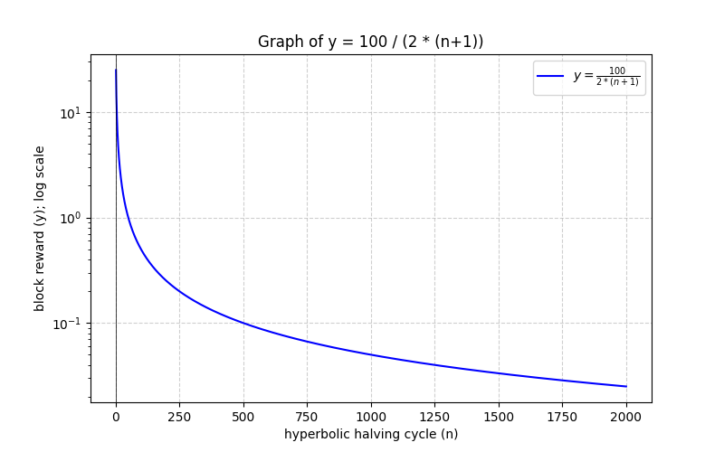

# Mining

คือ official game hook บนระบบ fields ที่ใช้การขุดเหรียญแบบ Proof-of-Work (PoW) โดยเชื่อมโยงกับ NFT ที่ถูกนำไปวางค้ำประกัน (Stake) ผ่านระบบ `CmdaoFieldsV2Router` ผู้ใช้สามารถเข้าร่วมขุดได้หากมี NFT ที่ได้รับสิทธิ์ และทำตามเงื่อนไขการขุด รางวัลจะลดลงเรื่อย ๆ ตามระยะเวลา และระบบจะปรับความยากให้เหมาะสมกับประสิทธิภาพของนักขุด

## วิธีการทำงาน

NFT ต้องมีสิทธิ์ขุด - NFT แต่ละชิ้นจะถูกกำหนดว่าสามารถใช้ขุดได้หรือไม่

ต้องมีการวางค้ำประกัน (Stake) - NFT ที่ใช้ขุดต้องถูกนำไป Stake ไว้ในระบบ

แก้โจทย์คำนวณ (Proof-of-Work) - นักขุดต้องสร้างค่าแฮช (Hash) ที่ถูกต้องตามเงื่อนไขของระบบ

ได้รับรางวัล - เมื่อขุดสำเร็จ นักขุดจะได้รับโทเค็นเป็นรางวัล

ปรับระดับความยาก - ระบบจะปรับความยากในการขุดทุก ๆ 10 บล็อกเพื่อให้เหมาะสมกับเวลาในการขุด

## กฎของการขุด

รางวัลการขุดลดลงเมื่อเวลาผ่านไป: เริ่มต้นที่ 50 เหรียญต่อบล็อก และลดลงตามสูตร

ความยากในการขุดปรับตามเวลาที่ใช้ขุด: หากขุดเร็วไป ระบบจะเพิ่มความยาก แต่ถ้าขุดช้าเกินไป ระบบจะลดความยากลง

การขุดต้องทำตามเงื่อนไข: นักขุดต้องใช้ข้อมูลที่ถูกต้อง และค่าแฮชต้องอยู่ในระดับที่กำหนด

## ขั้นตอนการขุด

1. ตรวจสอบว่า NFT ของคุณสามารถขุดได้
2. ตรวจสอบว่า NFT ของคุณถูก Stake อยู่ในระบบ `CmdaoFieldsV2Router`
3. สร้างค่าแฮชที่ถูกต้อง
4. ส่งคำขอขุดไปที่ระบบ
5. หากสำเร็จ คุณจะได้รับรางวัลเป็นโทเค็น
6. ระบบจะปรับระดับความยากตามเวลาที่ใช้ขุด

## ตัวอย่าง Tokenomics ของ Wood V2 ($cmd-wood) บน JB Chain

### ข้อมูลทั่วไป
- ชื่อโทเค็น: Wood V2 ($wood-v2)
- บล็อกเชน: JB Chain
- Block Time เป้าหมาย = 3 นาทีต่อบล็อก
- ระบบขุด (Mining Mechanism): Proof-of-Work (PoW) ที่ผูกกับ NFT
- NFT ที่ใช้ขุด: CommuDAO NFT (CMDAO-NFT)
- กลไกการลดความยาก (Difficulty Adjustment): ขึ้นอยู่กับค่า cmpow (เลข 5 ตัวท้ายของ NFT ID)

### ระบบรางวัลและการขุด

Wood V2 ใช้กลไกการขุดเพื่อกระจายโทเค็นให้กับผู้ใช้งานที่ถือ CMDAO-NFT โดยรางวัลจากการขุดคำนวณตามสูตรต่อไปนี้:

#### การคำนวณรางวัลการขุด

รางวัลจากการขุดขึ้นอยู่กับจำนวนบล็อกที่ถูกขุดไปแล้ว โดยรางวัลลดลงเมื่อเวลาผ่านไป ตามสูตร:

$$
Reward = \frac{100 \times 10^{18}}{2 \times ((currentBlock / 100000) + 1)}
$$

ตัวอย่าง:
- ถ้าขุดได้ที่บล็อก 50,000 → Reward = $\frac{100}{2} = 50$ Wood V2
- ถ้าขุดได้ที่บล็อก 150,000 → Reward = $\frac{100}{4} = 25$ Wood V2

#### การปรับค่าความยาก (Difficulty Adjustment)

ระบบจะปรับค่าความยากทุก 10 บล็อก โดยคำนวณจากระยะเวลาการขุดจริงระหว่างรอยต่อของการปรับค่าความยาก เมื่อเทียบกับเป้าหมาย 50 นาที

กลไกการลดค่าความยากเฉพาะสำหรับ CMDAO-NFT:
- NFT แต่ละตัวมีค่า cmpow ซึ่งเป็น เลข 5 ตัวสุดท้ายของ NFT ID
- ค่าความยากของนักขุดจะลดลงตามสูตร:
$$
minerDifficulty = currentDifficulty - (cmpow \mod 100000) / 1000
$$

ตัวอย่าง:
- NFT ID = 123456789012345 → ค่า cmpow = 12345
- ค่าความยากลดลง 12345 ÷ 1000 = 12
- ถ้าค่าความยากเดิมเป็น 100 → ค่าความยากที่ใช้ขุดจริง = 88

### ความสมดุลของระบบ (Sustainability Mechanism)
- ความยากเพิ่มขึ้นหากขุดเร็วเกินไป เพื่อรักษาความสมดุล
- รางวัลลดลงเมื่อบล็อกสูงขึ้น เพื่อลดอัตราเงินเฟ้อ
- CMDAO-NFT ช่วยลดค่าความยาก เพื่อให้ผู้ถือ NFT มีโอกาสขุดได้มากขึ้น

### ตาราง Hyperbolic Halving ของ Wood V2

คำนวณอัตราการปล่อยโทเค็น Wood V2 ($wood-v2) ตามระบบ Hyperbolic Halving โดยใช้ข้อมูลต่อไปนี้:
- Hyperbolic Halving ทุก 100,000 บล็อก
- Minimum Block Time เป้าหมาย = 3 นาที
- สูตรคำนวณจำนวนเหรียญที่ปล่อยออกมาทุก Hyperbolic Halving Cycle
$$
\sum_{n=0}^{N} \left( \frac{100}{2^(n+1)} \times 100,000 \right)
$$
โดย n คือรอบของ Hyperbolic Halving

|Halving Cycle|Block Height|Reward (Wood V2/block)|Tokens Released in Cycle|Cumulative Supply|Minimum Days Pass|
|-------------|------------|----------------------|------------------------|-----------------|-----------------|
|0            |100000      |50                    |5,000,000               |5,000,000        |20.83333333      |
|1            |200000      |25                    |2,500,000               |7,500,000        |41.66666667      |
|2            |300000      |16.66666667           |1,666,667               |9,166,667        |62.5             |
|3            |400000      |12.5                  |1,250,000               |10,416,667       |83.33333333      |
|4            |500000      |10                    |1,000,000               |11,416,667       |104.1666667      |
|5            |600000      |8.333333333           |833,333                 |12,250,000       |125              |
|6            |700000      |7.142857143           |714,286                 |12,964,286       |145.8333333      |
|7            |800000      |6.25                  |625,000                 |13,589,286       |166.6666667      |
|8            |900000      |5.555555556           |555,556                 |14,144,841       |187.5            |
|9            |1000000     |5                     |500,000                 |14,644,841       |208.3333333      |
|10           |1100000     |4.545454545           |454,545                 |15,099,387       |229.1666667      |
|11           |1200000     |4.166666667           |416,667                 |15,516,053       |250              |
|12           |1300000     |3.846153846           |384,615                 |15,900,669       |270.8333333      |
|13           |1400000     |3.571428571           |357,143                 |16,257,812       |291.6666667      |
|14           |1500000     |3.333333333           |333,333                 |16,591,145       |312.5            |
|15           |1600000     |3.125                 |312,500                 |16,903,645       |333.3333333      |
|16           |1700000     |2.941176471           |294,118                 |17,197,763       |354.1666667      |
|17           |1800000     |2.777777778           |277,778                 |17,475,540       |375              |
|18           |1900000     |2.631578947           |263,158                 |17,738,698       |395.8333333      |
|19           |2000000     |2.5                   |250,000                 |17,988,698       |416.6666667      |
|20           |2100000     |2.380952381           |238,095                 |18,226,794       |437.5            |
|21           |2200000     |2.272727273           |227,273                 |18,454,066       |458.3333333      |
|22           |2300000     |2.173913043           |217,391                 |18,671,458       |479.1666667      |
|23           |2400000     |2.083333333           |208,333                 |18,879,791       |500              |
|24           |2500000     |2                     |200,000                 |19,079,791       |520.8333333      |
|25           |2600000     |1.923076923           |192,308                 |19,272,099       |541.6666667      |
|26           |2700000     |1.851851852           |185,185                 |19,457,284       |562.5            |
|27           |2800000     |1.785714286           |178,571                 |19,635,855       |583.3333333      |
|28           |2900000     |1.724137931           |172,414                 |19,808,269       |604.1666667      |
|29           |3000000     |1.666666667           |166,667                 |19,974,936       |625              |
|30           |3100000     |1.612903226           |161,290                 |20,136,226       |645.8333333      |
|31           |3200000     |1.5625                |156,250                 |20,292,476       |666.6666667      |
|32           |3300000     |1.515151515           |151,515                 |20,443,991       |687.5            |
|33           |3400000     |1.470588235           |147,059                 |20,591,050       |708.3333333      |
|34           |3500000     |1.428571429           |142,857                 |20,733,907       |729.1666667      |
|35           |3600000     |1.388888889           |138,889                 |20,872,796       |750              |
|36           |3700000     |1.351351351           |135,135                 |21,007,931       |770.8333333      |
|37           |3800000     |1.315789474           |131,579                 |21,139,510       |791.6666667      |
|38           |3900000     |1.282051282           |128,205                 |21,267,715       |812.5            |
|39           |4000000     |1.25                  |125,000                 |21,392,715       |833.3333333      |
|40           |4100000     |1.219512195           |121,951                 |21,514,666       |854.1666667      |
|41           |4200000     |1.19047619            |119,048                 |21,633,714       |875              |
|42           |4300000     |1.162790698           |116,279                 |21,749,993       |895.8333333      |
|43           |4400000     |1.136363636           |113,636                 |21,863,629       |916.6666667      |
|44           |4500000     |1.111111111           |111,111                 |21,974,741       |937.5            |
|45           |4600000     |1.086956522           |108,696                 |22,083,436       |958.3333333      |
|46           |4700000     |1.063829787           |106,383                 |22,189,819       |979.1666667      |
|47           |4800000     |1.041666667           |104,167                 |22,293,986       |1000             |
|48           |4900000     |1.020408163           |102,041                 |22,396,027       |1020.833333      |
|49           |5000000     |1                     |100,000                 |22,496,027       |1041.666667      |
|50           |5100000     |0.9803921569          |98,039                  |22,594,066       |1062.5           |
|51           |5200000     |0.9615384615          |96,154                  |22,690,220       |1083.333333      |
|52           |5300000     |0.9433962264          |94,340                  |22,784,559       |1104.166667      |
|53           |5400000     |0.9259259259          |92,593                  |22,877,152       |1125             |
|54           |5500000     |0.9090909091          |90,909                  |22,968,061       |1145.833333      |
|55           |5600000     |0.8928571429          |89,286                  |23,057,347       |1166.666667      |
|56           |5700000     |0.8771929825          |87,719                  |23,145,066       |1187.5           |
|57           |5800000     |0.8620689655          |86,207                  |23,231,273       |1208.333333      |
|58           |5900000     |0.8474576271          |84,746                  |23,316,019       |1229.166667      |
|59           |6000000     |0.8333333333          |83,333                  |23,399,352       |1250             |
|60           |6100000     |0.8196721311          |81,967                  |23,481,319       |1270.833333      |
|61           |6200000     |0.8064516129          |80,645                  |23,561,964       |1291.666667      |
|62           |6300000     |0.7936507937          |79,365                  |23,641,330       |1312.5           |
|63           |6400000     |0.78125               |78,125                  |23,719,455       |1333.333333      |
|64           |6500000     |0.7692307692          |76,923                  |23,796,378       |1354.166667      |
|65           |6600000     |0.7575757576          |75,758                  |23,872,135       |1375             |
|66           |6700000     |0.7462686567          |74,627                  |23,946,762       |1395.833333      |
|67           |6800000     |0.7352941176          |73,529                  |24,020,291       |1416.666667      |
|68           |6900000     |0.7246376812          |72,464                  |24,092,755       |1437.5           |
|69           |7000000     |0.7142857143          |71,429                  |24,164,184       |1458.333333      |
|70           |7100000     |0.7042253521          |70,423                  |24,234,606       |1479.166667      |
|71           |7200000     |0.6944444444          |69,444                  |24,304,051       |1500             |
|72           |7300000     |0.6849315068          |68,493                  |24,372,544       |1520.833333      |
|73           |7400000     |0.6756756757          |67,568                  |24,440,111       |1541.666667      |
|74           |7500000     |0.6666666667          |66,667                  |24,506,778       |1562.5           |
|75           |7600000     |0.6578947368          |65,789                  |24,572,568       |1583.333333      |
|76           |7700000     |0.6493506494          |64,935                  |24,637,503       |1604.166667      |
|77           |7800000     |0.641025641           |64,103                  |24,701,605       |1625             |
|78           |7900000     |0.6329113924          |63,291                  |24,764,896       |1645.833333      |
|79           |8000000     |0.625                 |62,500                  |24,827,396       |1666.666667      |
|80           |8100000     |0.6172839506          |61,728                  |24,889,125       |1687.5           |
|81           |8200000     |0.6097560976          |60,976                  |24,950,100       |1708.333333      |
|82           |8300000     |0.6024096386          |60,241                  |25,010,341       |1729.166667      |
|83           |8400000     |0.5952380952          |59,524                  |25,069,865       |1750             |
|84           |8500000     |0.5882352941          |58,824                  |25,128,689       |1770.833333      |
|85           |8600000     |0.5813953488          |58,140                  |25,186,828       |1791.666667      |
|86           |8700000     |0.5747126437          |57,471                  |25,244,300       |1812.5           |
|87           |8800000     |0.5681818182          |56,818                  |25,301,118       |1833.333333      |
|88           |8900000     |0.5617977528          |56,180                  |25,357,297       |1854.166667      |
|89           |9000000     |0.5555555556          |55,556                  |25,412,853       |1875             |
|90           |9100000     |0.5494505495          |54,945                  |25,467,798       |1895.833333      |
|91           |9200000     |0.5434782609          |54,348                  |25,522,146       |1916.666667      |
|92           |9300000     |0.5376344086          |53,763                  |25,575,909       |1937.5           |
|93           |9400000     |0.5319148936          |53,191                  |25,629,101       |1958.333333      |
|94           |9500000     |0.5263157895          |52,632                  |25,681,732       |1979.166667      |
|95           |9600000     |0.5208333333          |52,083                  |25,733,816       |2000             |
|96           |9700000     |0.5154639175          |51,546                  |25,785,362       |2020.833333      |
|97           |9800000     |0.5102040816          |51,020                  |25,836,383       |2041.666667      |
|98           |9900000     |0.5050505051          |50,505                  |25,886,888       |2062.5           |
|99           |10000000    |0.5                   |50,000                  |25,936,888       |2083.333333      |
|100          |10100000    |0.495049505           |49,505                  |25,986,393       |2104.166667      |
|101          |10200000    |0.4901960784          |49,020                  |26,035,412       |2125             |
|102          |10300000    |0.4854368932          |48,544                  |26,083,956       |2145.833333      |
|103          |10400000    |0.4807692308          |48,077                  |26,132,033       |2166.666667      |
|104          |10500000    |0.4761904762          |47,619                  |26,179,652       |2187.5           |
|105          |10600000    |0.4716981132          |47,170                  |26,226,822       |2208.333333      |
|106          |10700000    |0.4672897196          |46,729                  |26,273,551       |2229.166667      |
|107          |10800000    |0.462962963           |46,296                  |26,319,847       |2250             |
|108          |10900000    |0.4587155963          |45,872                  |26,365,718       |2270.833333      |
|109          |11000000    |0.4545454545          |45,455                  |26,411,173       |2291.666667      |
|110          |11100000    |0.4504504505          |45,045                  |26,456,218       |2312.5           |
|111          |11200000    |0.4464285714          |44,643                  |26,500,861       |2333.333333      |
|112          |11300000    |0.4424778761          |44,248                  |26,545,109       |2354.166667      |
|113          |11400000    |0.4385964912          |43,860                  |26,588,968       |2375             |
|114          |11500000    |0.4347826087          |43,478                  |26,632,447       |2395.833333      |
|115          |11600000    |0.4310344828          |43,103                  |26,675,550       |2416.666667      |
|116          |11700000    |0.4273504274          |42,735                  |26,718,285       |2437.5           |
|117          |11800000    |0.4237288136          |42,373                  |26,760,658       |2458.333333      |
|118          |11900000    |0.4201680672          |42,017                  |26,802,675       |2479.166667      |
|119          |12000000    |0.4166666667          |41,667                  |26,844,341       |2500             |
|120          |12100000    |0.4132231405          |41,322                  |26,885,664       |2520.833333      |
|121          |12200000    |0.4098360656          |40,984                  |26,926,647       |2541.666667      |
|122          |12300000    |0.406504065           |40,650                  |26,967,298       |2562.5           |
|123          |12400000    |0.4032258065          |40,323                  |27,007,620       |2583.333333      |
|124          |12500000    |0.4                   |40,000                  |27,047,620       |2604.166667      |
|125          |12600000    |0.3968253968          |39,683                  |27,087,303       |2625             |
|126          |12700000    |0.3937007874          |39,370                  |27,126,673       |2645.833333      |
|127          |12800000    |0.390625              |39,063                  |27,165,735       |2666.666667      |
|128          |12900000    |0.3875968992          |38,760                  |27,204,495       |2687.5           |
|129          |13000000    |0.3846153846          |38,462                  |27,242,957       |2708.333333      |
|130          |13100000    |0.3816793893          |38,168                  |27,281,125       |2729.166667      |
|131          |13200000    |0.3787878788          |37,879                  |27,319,003       |2750             |
|132          |13300000    |0.3759398496          |37,594                  |27,356,597       |2770.833333      |
|133          |13400000    |0.3731343284          |37,313                  |27,393,911       |2791.666667      |
|134          |13500000    |0.3703703704          |37,037                  |27,430,948       |2812.5           |
|135          |13600000    |0.3676470588          |36,765                  |27,467,713       |2833.333333      |
|136          |13700000    |0.3649635036          |36,496                  |27,504,209       |2854.166667      |
|137          |13800000    |0.3623188406          |36,232                  |27,540,441       |2875             |
|138          |13900000    |0.3597122302          |35,971                  |27,576,412       |2895.833333      |
|139          |14000000    |0.3571428571          |35,714                  |27,612,126       |2916.666667      |
|140          |14100000    |0.3546099291          |35,461                  |27,647,587       |2937.5           |
|141          |14200000    |0.3521126761          |35,211                  |27,682,799       |2958.333333      |
|142          |14300000    |0.3496503497          |34,965                  |27,717,764       |2979.166667      |
|143          |14400000    |0.3472222222          |34,722                  |27,752,486       |3000             |
|144          |14500000    |0.3448275862          |34,483                  |27,786,969       |3020.833333      |
|145          |14600000    |0.3424657534          |34,247                  |27,821,215       |3041.666667      |
|146          |14700000    |0.3401360544          |34,014                  |27,855,229       |3062.5           |
|147          |14800000    |0.3378378378          |33,784                  |27,889,013       |3083.333333      |
|148          |14900000    |0.3355704698          |33,557                  |27,922,570       |3104.166667      |
|149          |15000000    |0.3333333333          |33,333                  |27,955,903       |3125             |
|150          |15100000    |0.3311258278          |33,113                  |27,989,016       |3145.833333      |
|151          |15200000    |0.3289473684          |32,895                  |28,021,910       |3166.666667      |
|152          |15300000    |0.3267973856          |32,680                  |28,054,590       |3187.5           |
|153          |15400000    |0.3246753247          |32,468                  |28,087,058       |3208.333333      |
|154          |15500000    |0.3225806452          |32,258                  |28,119,316       |3229.166667      |
|155          |15600000    |0.3205128205          |32,051                  |28,151,367       |3250             |
|156          |15700000    |0.3184713376          |31,847                  |28,183,214       |3270.833333      |
|157          |15800000    |0.3164556962          |31,646                  |28,214,860       |3291.666667      |
|158          |15900000    |0.3144654088          |31,447                  |28,246,306       |3312.5           |
|159          |16000000    |0.3125                |31,250                  |28,277,556       |3333.333333      |
|160          |16100000    |0.3105590062          |31,056                  |28,308,612       |3354.166667      |
|161          |16200000    |0.3086419753          |30,864                  |28,339,476       |3375             |
|162          |16300000    |0.3067484663          |30,675                  |28,370,151       |3395.833333      |
|163          |16400000    |0.3048780488          |30,488                  |28,400,639       |3416.666667      |
|164          |16500000    |0.303030303           |30,303                  |28,430,942       |3437.5           |
|165          |16600000    |0.3012048193          |30,120                  |28,461,062       |3458.333333      |
|166          |16700000    |0.2994011976          |29,940                  |28,491,003       |3479.166667      |
|167          |16800000    |0.2976190476          |29,762                  |28,520,764       |3500             |
|168          |16900000    |0.2958579882          |29,586                  |28,550,350       |3520.833333      |
|169          |17000000    |0.2941176471          |29,412                  |28,579,762       |3541.666667      |
|170          |17100000    |0.2923976608          |29,240                  |28,609,002       |3562.5           |
|171          |17200000    |0.2906976744          |29,070                  |28,638,072       |3583.333333      |
|172          |17300000    |0.289017341           |28,902                  |28,666,973       |3604.166667      |
|173          |17400000    |0.2873563218          |28,736                  |28,695,709       |3625             |
|174          |17500000    |0.2857142857          |28,571                  |28,724,280       |3645.833333      |
|175          |17600000    |0.2840909091          |28,409                  |28,752,689       |3666.666667      |
|176          |17700000    |0.2824858757          |28,249                  |28,780,938       |3687.5           |
|177          |17800000    |0.2808988764          |28,090                  |28,809,028       |3708.333333      |
|178          |17900000    |0.2793296089          |27,933                  |28,836,961       |3729.166667      |
|179          |18000000    |0.2777777778          |27,778                  |28,864,739       |3750             |
|180          |18100000    |0.2762430939          |27,624                  |28,892,363       |3770.833333      |
|181          |18200000    |0.2747252747          |27,473                  |28,919,835       |3791.666667      |
|182          |18300000    |0.2732240437          |27,322                  |28,947,158       |3812.5           |
|183          |18400000    |0.2717391304          |27,174                  |28,974,332       |3833.333333      |
|184          |18500000    |0.2702702703          |27,027                  |29,001,359       |3854.166667      |
|185          |18600000    |0.2688172043          |26,882                  |29,028,241       |3875             |
|186          |18700000    |0.2673796791          |26,738                  |29,054,978       |3895.833333      |
|187          |18800000    |0.2659574468          |26,596                  |29,081,574       |3916.666667      |
|188          |18900000    |0.2645502646          |26,455                  |29,108,029       |3937.5           |
|189          |19000000    |0.2631578947          |26,316                  |29,134,345       |3958.333333      |
|190          |19100000    |0.2617801047          |26,178                  |29,160,523       |3979.166667      |
|191          |19200000    |0.2604166667          |26,042                  |29,186,565       |4000             |
|192          |19300000    |0.2590673575          |25,907                  |29,212,471       |4020.833333      |
|193          |19400000    |0.2577319588          |25,773                  |29,238,245       |4041.666667      |
|194          |19500000    |0.2564102564          |25,641                  |29,263,886       |4062.5           |
|195          |19600000    |0.2551020408          |25,510                  |29,289,396       |4083.333333      |
|196          |19700000    |0.2538071066          |25,381                  |29,314,777       |4104.166667      |
|197          |19800000    |0.2525252525          |25,253                  |29,340,029       |4125             |
|198          |19900000    |0.2512562814          |25,126                  |29,365,155       |4145.833333      |
|199          |20000000    |0.25                  |25,000                  |29,390,155       |4166.666667      |
|200          |20100000    |0.2487562189          |24,876                  |29,415,030       |4187.5           |
|201          |20200000    |0.2475247525          |24,752                  |29,439,783       |4208.333333      |
|202          |20300000    |0.2463054187          |24,631                  |29,464,413       |4229.166667      |
|203          |20400000    |0.2450980392          |24,510                  |29,488,923       |4250             |
|204          |20500000    |0.243902439           |24,390                  |29,513,313       |4270.833333      |
|205          |20600000    |0.2427184466          |24,272                  |29,537,585       |4291.666667      |
|206          |20700000    |0.2415458937          |24,155                  |29,561,740       |4312.5           |
|207          |20800000    |0.2403846154          |24,038                  |29,585,778       |4333.333333      |
|208          |20900000    |0.2392344498          |23,923                  |29,609,702       |4354.166667      |
|209          |21000000    |0.2380952381          |23,810                  |29,633,511       |4375             |
|210          |21100000    |0.2369668246          |23,697                  |29,657,208       |4395.833333      |
|211          |21200000    |0.2358490566          |23,585                  |29,680,793       |4416.666667      |
|212          |21300000    |0.234741784           |23,474                  |29,704,267       |4437.5           |
|213          |21400000    |0.2336448598          |23,364                  |29,727,632       |4458.333333      |
|214          |21500000    |0.2325581395          |23,256                  |29,750,887       |4479.166667      |
|215          |21600000    |0.2314814815          |23,148                  |29,774,036       |4500             |
|216          |21700000    |0.2304147465          |23,041                  |29,797,077       |4520.833333      |
|217          |21800000    |0.2293577982          |22,936                  |29,820,013       |4541.666667      |
|218          |21900000    |0.2283105023          |22,831                  |29,842,844       |4562.5           |
|219          |22000000    |0.2272727273          |22,727                  |29,865,571       |4583.333333      |
|220          |22100000    |0.2262443439          |22,624                  |29,888,196       |4604.166667      |
|221          |22200000    |0.2252252252          |22,523                  |29,910,718       |4625             |
|222          |22300000    |0.2242152466          |22,422                  |29,933,140       |4645.833333      |
|223          |22400000    |0.2232142857          |22,321                  |29,955,461       |4666.666667      |
|224          |22500000    |0.2222222222          |22,222                  |29,977,683       |4687.5           |
|225          |22600000    |0.2212389381          |22,124                  |29,999,807       |4708.333333      |
|226          |22700000    |0.2202643172          |22,026                  |30,021,834       |4729.166667      |
|227          |22800000    |0.2192982456          |21,930                  |30,043,763       |4750             |
|228          |22900000    |0.2183406114          |21,834                  |30,065,597       |4770.833333      |
|229          |23000000    |0.2173913043          |21,739                  |30,087,337       |4791.666667      |
|230          |23100000    |0.2164502165          |21,645                  |30,108,982       |4812.5           |
|231          |23200000    |0.2155172414          |21,552                  |30,130,533       |4833.333333      |
|232          |23300000    |0.2145922747          |21,459                  |30,151,993       |4854.166667      |
|233          |23400000    |0.2136752137          |21,368                  |30,173,360       |4875             |
|234          |23500000    |0.2127659574          |21,277                  |30,194,637       |4895.833333      |
|235          |23600000    |0.2118644068          |21,186                  |30,215,823       |4916.666667      |
|236          |23700000    |0.2109704641          |21,097                  |30,236,920       |4937.5           |
|237          |23800000    |0.2100840336          |21,008                  |30,257,929       |4958.333333      |
|238          |23900000    |0.2092050209          |20,921                  |30,278,849       |4979.166667      |
|239          |24000000    |0.2083333333          |20,833                  |30,299,682       |5000             |
|240          |24100000    |0.2074688797          |20,747                  |30,320,429       |5020.833333      |
|241          |24200000    |0.2066115702          |20,661                  |30,341,090       |5041.666667      |
|242          |24300000    |0.2057613169          |20,576                  |30,361,667       |5062.5           |
|243          |24400000    |0.2049180328          |20,492                  |30,382,158       |5083.333333      |
|244          |24500000    |0.2040816327          |20,408                  |30,402,567       |5104.166667      |
|245          |24600000    |0.2032520325          |20,325                  |30,422,892       |5125             |
|246          |24700000    |0.2024291498          |20,243                  |30,443,135       |5145.833333      |
|247          |24800000    |0.2016129032          |20,161                  |30,463,296       |5166.666667      |
|248          |24900000    |0.2008032129          |20,080                  |30,483,376       |5187.5           |
|249          |25000000    |0.2                   |20,000                  |30,503,376       |5208.333333      |
|250          |25100000    |0.1992031873          |19,920                  |30,523,297       |5229.166667      |
|251          |25200000    |0.1984126984          |19,841                  |30,543,138       |5250             |
|252          |25300000    |0.1976284585          |19,763                  |30,562,901       |5270.833333      |
|253          |25400000    |0.1968503937          |19,685                  |30,582,586       |5291.666667      |
|254          |25500000    |0.1960784314          |19,608                  |30,602,194       |5312.5           |
|255          |25600000    |0.1953125             |19,531                  |30,621,725       |5333.333333      |
|256          |25700000    |0.1945525292          |19,455                  |30,641,180       |5354.166667      |
|257          |25800000    |0.1937984496          |19,380                  |30,660,560       |5375             |
|258          |25900000    |0.1930501931          |19,305                  |30,679,865       |5395.833333      |
|259          |26000000    |0.1923076923          |19,231                  |30,699,096       |5416.666667      |
|260          |26100000    |0.1915708812          |19,157                  |30,718,253       |5437.5           |
|261          |26200000    |0.1908396947          |19,084                  |30,737,337       |5458.333333      |
|262          |26300000    |0.1901140684          |19,011                  |30,756,348       |5479.166667      |
|263          |26400000    |0.1893939394          |18,939                  |30,775,288       |5500             |
|264          |26500000    |0.1886792453          |18,868                  |30,794,155       |5520.833333      |
|265          |26600000    |0.1879699248          |18,797                  |30,812,952       |5541.666667      |
|266          |26700000    |0.1872659176          |18,727                  |30,831,679       |5562.5           |
|267          |26800000    |0.1865671642          |18,657                  |30,850,336       |5583.333333      |
|268          |26900000    |0.1858736059          |18,587                  |30,868,923       |5604.166667      |
|269          |27000000    |0.1851851852          |18,519                  |30,887,442       |5625             |
|270          |27100000    |0.184501845           |18,450                  |30,905,892       |5645.833333      |
|271          |27200000    |0.1838235294          |18,382                  |30,924,274       |5666.666667      |
|272          |27300000    |0.1831501832          |18,315                  |30,942,589       |5687.5           |
|273          |27400000    |0.1824817518          |18,248                  |30,960,837       |5708.333333      |
|274          |27500000    |0.1818181818          |18,182                  |30,979,019       |5729.166667      |
|275          |27600000    |0.1811594203          |18,116                  |30,997,135       |5750             |
|276          |27700000    |0.1805054152          |18,051                  |31,015,186       |5770.833333      |
|277          |27800000    |0.1798561151          |17,986                  |31,033,171       |5791.666667      |
|278          |27900000    |0.1792114695          |17,921                  |31,051,092       |5812.5           |
|279          |28000000    |0.1785714286          |17,857                  |31,068,950       |5833.333333      |
|280          |28100000    |0.1779359431          |17,794                  |31,086,743       |5854.166667      |
|281          |28200000    |0.1773049645          |17,730                  |31,104,474       |5875             |
|282          |28300000    |0.1766784452          |17,668                  |31,122,142       |5895.833333      |
|283          |28400000    |0.176056338           |17,606                  |31,139,747       |5916.666667      |
|284          |28500000    |0.1754385965          |17,544                  |31,157,291       |5937.5           |
|285          |28600000    |0.1748251748          |17,483                  |31,174,774       |5958.333333      |
|286          |28700000    |0.1742160279          |17,422                  |31,192,195       |5979.166667      |
|287          |28800000    |0.1736111111          |17,361                  |31,209,556       |6000             |
|288          |28900000    |0.1730103806          |17,301                  |31,226,857       |6020.833333      |
|289          |29000000    |0.1724137931          |17,241                  |31,244,099       |6041.666667      |
|290          |29100000    |0.1718213058          |17,182                  |31,261,281       |6062.5           |
|291          |29200000    |0.1712328767          |17,123                  |31,278,404       |6083.333333      |
|292          |29300000    |0.1706484642          |17,065                  |31,295,469       |6104.166667      |
|293          |29400000    |0.1700680272          |17,007                  |31,312,476       |6125             |
|294          |29500000    |0.1694915254          |16,949                  |31,329,425       |6145.833333      |
|295          |29600000    |0.1689189189          |16,892                  |31,346,317       |6166.666667      |
|296          |29700000    |0.1683501684          |16,835                  |31,363,152       |6187.5           |
|297          |29800000    |0.1677852349          |16,779                  |31,379,930       |6208.333333      |
|298          |29900000    |0.1672240803          |16,722                  |31,396,653       |6229.166667      |
|299          |30000000    |0.1666666667          |16,667                  |31,413,319       |6250             |
|300          |30100000    |0.1661129568          |16,611                  |31,429,931       |6270.833333      |
|301          |30200000    |0.1655629139          |16,556                  |31,446,487       |6291.666667      |
|302          |30300000    |0.1650165017          |16,502                  |31,462,989       |6312.5           |
|303          |30400000    |0.1644736842          |16,447                  |31,479,436       |6333.333333      |
|304          |30500000    |0.1639344262          |16,393                  |31,495,829       |6354.166667      |
|305          |30600000    |0.1633986928          |16,340                  |31,512,169       |6375             |
|306          |30700000    |0.1628664495          |16,287                  |31,528,456       |6395.833333      |
|307          |30800000    |0.1623376623          |16,234                  |31,544,690       |6416.666667      |
|308          |30900000    |0.1618122977          |16,181                  |31,560,871       |6437.5           |
|309          |31000000    |0.1612903226          |16,129                  |31,577,000       |6458.333333      |
|310          |31100000    |0.1607717042          |16,077                  |31,593,077       |6479.166667      |
|311          |31200000    |0.1602564103          |16,026                  |31,609,103       |6500             |
|312          |31300000    |0.1597444089          |15,974                  |31,625,077       |6520.833333      |
|313          |31400000    |0.1592356688          |15,924                  |31,641,001       |6541.666667      |
|314          |31500000    |0.1587301587          |15,873                  |31,656,874       |6562.5           |
|315          |31600000    |0.1582278481          |15,823                  |31,672,697       |6583.333333      |
|316          |31700000    |0.1577287066          |15,773                  |31,688,469       |6604.166667      |
|317          |31800000    |0.1572327044          |15,723                  |31,704,193       |6625             |
|318          |31900000    |0.1567398119          |15,674                  |31,719,867       |6645.833333      |
|319          |32000000    |0.15625               |15,625                  |31,735,492       |6666.666667      |
|320          |32100000    |0.1557632399          |15,576                  |31,751,068       |6687.5           |
|321          |32200000    |0.1552795031          |15,528                  |31,766,596       |6708.333333      |
|322          |32300000    |0.1547987616          |15,480                  |31,782,076       |6729.166667      |
|323          |32400000    |0.1543209877          |15,432                  |31,797,508       |6750             |
|324          |32500000    |0.1538461538          |15,385                  |31,812,893       |6770.833333      |
|325          |32600000    |0.1533742331          |15,337                  |31,828,230       |6791.666667      |
|326          |32700000    |0.1529051988          |15,291                  |31,843,521       |6812.5           |
|327          |32800000    |0.1524390244          |15,244                  |31,858,764       |6833.333333      |
|328          |32900000    |0.1519756839          |15,198                  |31,873,962       |6854.166667      |
|329          |33000000    |0.1515151515          |15,152                  |31,889,114       |6875             |
|330          |33100000    |0.1510574018          |15,106                  |31,904,219       |6895.833333      |
|331          |33200000    |0.1506024096          |15,060                  |31,919,280       |6916.666667      |
|332          |33300000    |0.1501501502          |15,015                  |31,934,295       |6937.5           |
|333          |33400000    |0.1497005988          |14,970                  |31,949,265       |6958.333333      |
|334          |33500000    |0.1492537313          |14,925                  |31,964,190       |6979.166667      |
|335          |33600000    |0.1488095238          |14,881                  |31,979,071       |7000             |
|336          |33700000    |0.1483679525          |14,837                  |31,993,908       |7020.833333      |
|337          |33800000    |0.1479289941          |14,793                  |32,008,701       |7041.666667      |
|338          |33900000    |0.1474926254          |14,749                  |32,023,450       |7062.5           |
|339          |34000000    |0.1470588235          |14,706                  |32,038,156       |7083.333333      |
|340          |34100000    |0.146627566           |14,663                  |32,052,819       |7104.166667      |
|341          |34200000    |0.1461988304          |14,620                  |32,067,438       |7125             |
|342          |34300000    |0.1457725948          |14,577                  |32,082,016       |7145.833333      |
|343          |34400000    |0.1453488372          |14,535                  |32,096,551       |7166.666667      |
|344          |34500000    |0.1449275362          |14,493                  |32,111,043       |7187.5           |
|345          |34600000    |0.1445086705          |14,451                  |32,125,494       |7208.333333      |
|346          |34700000    |0.144092219           |14,409                  |32,139,903       |7229.166667      |
|347          |34800000    |0.1436781609          |14,368                  |32,154,271       |7250             |
|348          |34900000    |0.1432664756          |14,327                  |32,168,598       |7270.833333      |
|349          |35000000    |0.1428571429          |14,286                  |32,182,884       |7291.666667      |
|350          |35100000    |0.1424501425          |14,245                  |32,197,129       |7312.5           |
|351          |35200000    |0.1420454545          |14,205                  |32,211,333       |7333.333333      |
|352          |35300000    |0.1416430595          |14,164                  |32,225,497       |7354.166667      |
|353          |35400000    |0.1412429379          |14,124                  |32,239,622       |7375             |
|354          |35500000    |0.1408450704          |14,085                  |32,253,706       |7395.833333      |
|355          |35600000    |0.1404494382          |14,045                  |32,267,751       |7416.666667      |
|356          |35700000    |0.1400560224          |14,006                  |32,281,757       |7437.5           |
|357          |35800000    |0.1396648045          |13,966                  |32,295,723       |7458.333333      |
|358          |35900000    |0.139275766           |13,928                  |32,309,651       |7479.166667      |
|359          |36000000    |0.1388888889          |13,889                  |32,323,540       |7500             |
|360          |36100000    |0.1385041551          |13,850                  |32,337,390       |7520.833333      |
|361          |36200000    |0.138121547           |13,812                  |32,351,202       |7541.666667      |
|362          |36300000    |0.1377410468          |13,774                  |32,364,976       |7562.5           |
|363          |36400000    |0.1373626374          |13,736                  |32,378,713       |7583.333333      |
|364          |36500000    |0.1369863014          |13,699                  |32,392,411       |7604.166667      |
|365          |36600000    |0.1366120219          |13,661                  |32,406,072       |7625             |
|366          |36700000    |0.136239782           |13,624                  |32,419,696       |7645.833333      |
|367          |36800000    |0.1358695652          |13,587                  |32,433,283       |7666.666667      |
|368          |36900000    |0.135501355           |13,550                  |32,446,834       |7687.5           |
|369          |37000000    |0.1351351351          |13,514                  |32,460,347       |7708.333333      |
|370          |37100000    |0.1347708895          |13,477                  |32,473,824       |7729.166667      |
|371          |37200000    |0.1344086022          |13,441                  |32,487,265       |7750             |
|372          |37300000    |0.1340482574          |13,405                  |32,500,670       |7770.833333      |
|373          |37400000    |0.1336898396          |13,369                  |32,514,039       |7791.666667      |
|374          |37500000    |0.1333333333          |13,333                  |32,527,372       |7812.5           |
|375          |37600000    |0.1329787234          |13,298                  |32,540,670       |7833.333333      |
|376          |37700000    |0.1326259947          |13,263                  |32,553,933       |7854.166667      |
|377          |37800000    |0.1322751323          |13,228                  |32,567,160       |7875             |
|378          |37900000    |0.1319261214          |13,193                  |32,580,353       |7895.833333      |
|379          |38000000    |0.1315789474          |13,158                  |32,593,511       |7916.666667      |
|380          |38100000    |0.1312335958          |13,123                  |32,606,634       |7937.5           |
|381          |38200000    |0.1308900524          |13,089                  |32,619,723       |7958.333333      |
|382          |38300000    |0.1305483029          |13,055                  |32,632,778       |7979.166667      |
|383          |38400000    |0.1302083333          |13,021                  |32,645,799       |8000             |
|384          |38500000    |0.1298701299          |12,987                  |32,658,786       |8020.833333      |
|385          |38600000    |0.1295336788          |12,953                  |32,671,739       |8041.666667      |
|386          |38700000    |0.1291989664          |12,920                  |32,684,659       |8062.5           |
|387          |38800000    |0.1288659794          |12,887                  |32,697,546       |8083.333333      |
|388          |38900000    |0.1285347044          |12,853                  |32,710,399       |8104.166667      |
|389          |39000000    |0.1282051282          |12,821                  |32,723,220       |8125             |
|390          |39100000    |0.1278772379          |12,788                  |32,736,007       |8145.833333      |
|391          |39200000    |0.1275510204          |12,755                  |32,748,762       |8166.666667      |
|392          |39300000    |0.1272264631          |12,723                  |32,761,485       |8187.5           |
|393          |39400000    |0.1269035533          |12,690                  |32,774,175       |8208.333333      |
|394          |39500000    |0.1265822785          |12,658                  |32,786,834       |8229.166667      |
|395          |39600000    |0.1262626263          |12,626                  |32,799,460       |8250             |
|396          |39700000    |0.1259445844          |12,594                  |32,812,054       |8270.833333      |
|397          |39800000    |0.1256281407          |12,563                  |32,824,617       |8291.666667      |
|398          |39900000    |0.1253132832          |12,531                  |32,837,148       |8312.5           |
|399          |40000000    |0.125                 |12,500                  |32,849,648       |8333.333333      |
|400          |40100000    |0.1246882793          |12,469                  |32,862,117       |8354.166667      |
|401          |40200000    |0.1243781095          |12,438                  |32,874,555       |8375             |
|402          |40300000    |0.1240694789          |12,407                  |32,886,962       |8395.833333      |
|403          |40400000    |0.1237623762          |12,376                  |32,899,338       |8416.666667      |
|404          |40500000    |0.1234567901          |12,346                  |32,911,684       |8437.5           |
|405          |40600000    |0.1231527094          |12,315                  |32,923,999       |8458.333333      |
|406          |40700000    |0.1228501229          |12,285                  |32,936,284       |8479.166667      |
|407          |40800000    |0.1225490196          |12,255                  |32,948,539       |8500             |
|408          |40900000    |0.1222493888          |12,225                  |32,960,764       |8520.833333      |
|409          |41000000    |0.1219512195          |12,195                  |32,972,959       |8541.666667      |
|410          |41100000    |0.1216545012          |12,165                  |32,985,125       |8562.5           |
|411          |41200000    |0.1213592233          |12,136                  |32,997,261       |8583.333333      |
|412          |41300000    |0.1210653753          |12,107                  |33,009,367       |8604.166667      |
|413          |41400000    |0.1207729469          |12,077                  |33,021,444       |8625             |
|414          |41500000    |0.1204819277          |12,048                  |33,033,493       |8645.833333      |
|415          |41600000    |0.1201923077          |12,019                  |33,045,512       |8666.666667      |
|416          |41700000    |0.1199040767          |11,990                  |33,057,502       |8687.5           |
|417          |41800000    |0.1196172249          |11,962                  |33,069,464       |8708.333333      |
|418          |41900000    |0.1193317422          |11,933                  |33,081,397       |8729.166667      |
|419          |42000000    |0.119047619           |11,905                  |33,093,302       |8750             |
|420          |42100000    |0.1187648456          |11,876                  |33,105,178       |8770.833333      |
|421          |42200000    |0.1184834123          |11,848                  |33,117,027       |8791.666667      |
|422          |42300000    |0.1182033097          |11,820                  |33,128,847       |8812.5           |
|423          |42400000    |0.1179245283          |11,792                  |33,140,640       |8833.333333      |
|424          |42500000    |0.1176470588          |11,765                  |33,152,404       |8854.166667      |
|425          |42600000    |0.117370892           |11,737                  |33,164,141       |8875             |
|426          |42700000    |0.1170960187          |11,710                  |33,175,851       |8895.833333      |
|427          |42800000    |0.1168224299          |11,682                  |33,187,533       |8916.666667      |
|428          |42900000    |0.1165501166          |11,655                  |33,199,188       |8937.5           |
|429          |43000000    |0.1162790698          |11,628                  |33,210,816       |8958.333333      |
|430          |43100000    |0.1160092807          |11,601                  |33,222,417       |8979.166667      |
|431          |43200000    |0.1157407407          |11,574                  |33,233,991       |9000             |
|432          |43300000    |0.1154734411          |11,547                  |33,245,538       |9020.833333      |
|433          |43400000    |0.1152073733          |11,521                  |33,257,059       |9041.666667      |
|434          |43500000    |0.1149425287          |11,494                  |33,268,553       |9062.5           |
|435          |43600000    |0.1146788991          |11,468                  |33,280,021       |9083.333333      |
|436          |43700000    |0.114416476           |11,442                  |33,291,463       |9104.166667      |
|437          |43800000    |0.1141552511          |11,416                  |33,302,878       |9125             |
|438          |43900000    |0.1138952164          |11,390                  |33,314,268       |9145.833333      |
|439          |44000000    |0.1136363636          |11,364                  |33,325,632       |9166.666667      |
|440          |44100000    |0.1133786848          |11,338                  |33,336,969       |9187.5           |
|441          |44200000    |0.1131221719          |11,312                  |33,348,282       |9208.333333      |
|442          |44300000    |0.1128668172          |11,287                  |33,359,568       |9229.166667      |
|443          |44400000    |0.1126126126          |11,261                  |33,370,830       |9250             |
|444          |44500000    |0.1123595506          |11,236                  |33,382,066       |9270.833333      |
|445          |44600000    |0.1121076233          |11,211                  |33,393,276       |9291.666667      |
|446          |44700000    |0.1118568233          |11,186                  |33,404,462       |9312.5           |
|447          |44800000    |0.1116071429          |11,161                  |33,415,623       |9333.333333      |
|448          |44900000    |0.1113585746          |11,136                  |33,426,759       |9354.166667      |
|449          |45000000    |0.1111111111          |11,111                  |33,437,870       |9375             |
|450          |45100000    |0.110864745           |11,086                  |33,448,956       |9395.833333      |
|451          |45200000    |0.110619469           |11,062                  |33,460,018       |9416.666667      |
|452          |45300000    |0.1103752759          |11,038                  |33,471,056       |9437.5           |
|453          |45400000    |0.1101321586          |11,013                  |33,482,069       |9458.333333      |
|454          |45500000    |0.1098901099          |10,989                  |33,493,058       |9479.166667      |
|455          |45600000    |0.1096491228          |10,965                  |33,504,023       |9500             |
|456          |45700000    |0.1094091904          |10,941                  |33,514,964       |9520.833333      |
|457          |45800000    |0.1091703057          |10,917                  |33,525,881       |9541.666667      |
|458          |45900000    |0.1089324619          |10,893                  |33,536,774       |9562.5           |
|459          |46000000    |0.1086956522          |10,870                  |33,547,644       |9583.333333      |
|460          |46100000    |0.1084598698          |10,846                  |33,558,490       |9604.166667      |
|461          |46200000    |0.1082251082          |10,823                  |33,569,312       |9625             |
|462          |46300000    |0.1079913607          |10,799                  |33,580,111       |9645.833333      |
|463          |46400000    |0.1077586207          |10,776                  |33,590,887       |9666.666667      |
|464          |46500000    |0.1075268817          |10,753                  |33,601,640       |9687.5           |
|465          |46600000    |0.1072961373          |10,730                  |33,612,369       |9708.333333      |
|466          |46700000    |0.1070663812          |10,707                  |33,623,076       |9729.166667      |
|467          |46800000    |0.1068376068          |10,684                  |33,633,760       |9750             |
|468          |46900000    |0.1066098081          |10,661                  |33,644,421       |9770.833333      |
|469          |47000000    |0.1063829787          |10,638                  |33,655,059       |9791.666667      |
|470          |47100000    |0.1061571125          |10,616                  |33,665,675       |9812.5           |
|471          |47200000    |0.1059322034          |10,593                  |33,676,268       |9833.333333      |
|472          |47300000    |0.1057082452          |10,571                  |33,686,839       |9854.166667      |
|473          |47400000    |0.1054852321          |10,549                  |33,697,387       |9875             |
|474          |47500000    |0.1052631579          |10,526                  |33,707,914       |9895.833333      |
|475          |47600000    |0.1050420168          |10,504                  |33,718,418       |9916.666667      |
|476          |47700000    |0.1048218029          |10,482                  |33,728,900       |9937.5           |
|477          |47800000    |0.1046025105          |10,460                  |33,739,360       |9958.333333      |
|478          |47900000    |0.1043841336          |10,438                  |33,749,799       |9979.166667      |
|479          |48000000    |0.1041666667          |10,417                  |33,760,215       |10000            |
|480          |48100000    |0.103950104           |10,395                  |33,770,610       |10020.83333      |
|481          |48200000    |0.1037344398          |10,373                  |33,780,984       |10041.66667      |
|482          |48300000    |0.1035196687          |10,352                  |33,791,336       |10062.5          |
|483          |48400000    |0.1033057851          |10,331                  |33,801,666       |10083.33333      |
|484          |48500000    |0.1030927835          |10,309                  |33,811,976       |10104.16667      |
|485          |48600000    |0.1028806584          |10,288                  |33,822,264       |10125            |
|486          |48700000    |0.1026694045          |10,267                  |33,832,531       |10145.83333      |
|487          |48800000    |0.1024590164          |10,246                  |33,842,777       |10166.66667      |
|488          |48900000    |0.1022494888          |10,225                  |33,853,002       |10187.5          |
|489          |49000000    |0.1020408163          |10,204                  |33,863,206       |10208.33333      |
|490          |49100000    |0.1018329939          |10,183                  |33,873,389       |10229.16667      |
|491          |49200000    |0.1016260163          |10,163                  |33,883,551       |10250            |
|492          |49300000    |0.1014198783          |10,142                  |33,893,693       |10270.83333      |
|493          |49400000    |0.1012145749          |10,121                  |33,903,815       |10291.66667      |
|494          |49500000    |0.101010101           |10,101                  |33,913,916       |10312.5          |
|495          |49600000    |0.1008064516          |10,081                  |33,923,997       |10333.33333      |
|496          |49700000    |0.1006036217          |10,060                  |33,934,057       |10354.16667      |
|497          |49800000    |0.1004016064          |10,040                  |33,944,097       |10375            |
|498          |49900000    |0.1002004008          |10,020                  |33,954,117       |10395.83333      |
|499          |50000000    |0.1                   |10,000                  |33,964,117       |10416.66667      |
|500          |50100000    |0.0998003992          |9,980                   |33,974,097       |10437.5          |
|501          |50200000    |0.09960159363         |9,960                   |33,984,057       |10458.33333      |
|502          |50300000    |0.09940357853         |9,940                   |33,993,998       |10479.16667      |
|503          |50400000    |0.09920634921         |9,921                   |34,003,918       |10500            |
|504          |50500000    |0.09900990099         |9,901                   |34,013,819       |10520.83333      |
|505          |50600000    |0.09881422925         |9,881                   |34,023,701       |10541.66667      |
|506          |50700000    |0.09861932939         |9,862                   |34,033,563       |10562.5          |
|507          |50800000    |0.09842519685         |9,843                   |34,043,405       |10583.33333      |
|508          |50900000    |0.09823182711         |9,823                   |34,053,228       |10604.16667      |
|509          |51000000    |0.09803921569         |9,804                   |34,063,032       |10625            |
|510          |51100000    |0.09784735812         |9,785                   |34,072,817       |10645.83333      |
|511          |51200000    |0.09765625            |9,766                   |34,082,583       |10666.66667      |
|512          |51300000    |0.09746588694         |9,747                   |34,092,329       |10687.5          |
|513          |51400000    |0.09727626459         |9,728                   |34,102,057       |10708.33333      |
|514          |51500000    |0.09708737864         |9,709                   |34,111,766       |10729.16667      |
|515          |51600000    |0.09689922481         |9,690                   |34,121,456       |10750            |
|516          |51700000    |0.09671179884         |9,671                   |34,131,127       |10770.83333      |
|517          |51800000    |0.09652509653         |9,653                   |34,140,779       |10791.66667      |
|518          |51900000    |0.09633911368         |9,634                   |34,150,413       |10812.5          |
|519          |52000000    |0.09615384615         |9,615                   |34,160,029       |10833.33333      |
|520          |52100000    |0.09596928983         |9,597                   |34,169,625       |10854.16667      |
|521          |52200000    |0.09578544061         |9,579                   |34,179,204       |10875            |
|522          |52300000    |0.09560229446         |9,560                   |34,188,764       |10895.83333      |
|523          |52400000    |0.09541984733         |9,542                   |34,198,306       |10916.66667      |
|524          |52500000    |0.09523809524         |9,524                   |34,207,830       |10937.5          |
|525          |52600000    |0.09505703422         |9,506                   |34,217,336       |10958.33333      |
|526          |52700000    |0.09487666034         |9,488                   |34,226,823       |10979.16667      |
|527          |52800000    |0.0946969697          |9,470                   |34,236,293       |11000            |
|528          |52900000    |0.09451795841         |9,452                   |34,245,745       |11020.83333      |
|529          |53000000    |0.09433962264         |9,434                   |34,255,179       |11041.66667      |
|530          |53100000    |0.09416195857         |9,416                   |34,264,595       |11062.5          |
|531          |53200000    |0.09398496241         |9,398                   |34,273,994       |11083.33333      |
|532          |53300000    |0.09380863039         |9,381                   |34,283,374       |11104.16667      |
|533          |53400000    |0.0936329588          |9,363                   |34,292,738       |11125            |
|534          |53500000    |0.09345794393         |9,346                   |34,302,084       |11145.83333      |
|535          |53600000    |0.09328358209         |9,328                   |34,311,412       |11166.66667      |
|536          |53700000    |0.09310986965         |9,311                   |34,320,723       |11187.5          |
|537          |53800000    |0.09293680297         |9,294                   |34,330,017       |11208.33333      |
|538          |53900000    |0.09276437848         |9,276                   |34,339,293       |11229.16667      |
|539          |54000000    |0.09259259259         |9,259                   |34,348,552       |11250            |
|540          |54100000    |0.09242144177         |9,242                   |34,357,794       |11270.83333      |
|541          |54200000    |0.09225092251         |9,225                   |34,367,019       |11291.66667      |
|542          |54300000    |0.09208103131         |9,208                   |34,376,228       |11312.5          |
|543          |54400000    |0.09191176471         |9,191                   |34,385,419       |11333.33333      |
|544          |54500000    |0.09174311927         |9,174                   |34,394,593       |11354.16667      |
|545          |54600000    |0.09157509158         |9,158                   |34,403,751       |11375            |
|546          |54700000    |0.09140767824         |9,141                   |34,412,891       |11395.83333      |
|547          |54800000    |0.09124087591         |9,124                   |34,422,015       |11416.66667      |
|548          |54900000    |0.09107468124         |9,107                   |34,431,123       |11437.5          |
|549          |55000000    |0.09090909091         |9,091                   |34,440,214       |11458.33333      |
|550          |55100000    |0.09074410163         |9,074                   |34,449,288       |11479.16667      |
|551          |55200000    |0.09057971014         |9,058                   |34,458,346       |11500            |
|552          |55300000    |0.0904159132          |9,042                   |34,467,388       |11520.83333      |
|553          |55400000    |0.09025270758         |9,025                   |34,476,413       |11541.66667      |
|554          |55500000    |0.09009009009         |9,009                   |34,485,422       |11562.5          |
|555          |55600000    |0.08992805755         |8,993                   |34,494,415       |11583.33333      |
|556          |55700000    |0.08976660682         |8,977                   |34,503,392       |11604.16667      |
|557          |55800000    |0.08960573477         |8,961                   |34,512,352       |11625            |
|558          |55900000    |0.08944543828         |8,945                   |34,521,297       |11645.83333      |
|559          |56000000    |0.08928571429         |8,929                   |34,530,225       |11666.66667      |
|560          |56100000    |0.08912655971         |8,913                   |34,539,138       |11687.5          |
|561          |56200000    |0.08896797153         |8,897                   |34,548,035       |11708.33333      |
|562          |56300000    |0.08880994671         |8,881                   |34,556,916       |11729.16667      |
|563          |56400000    |0.08865248227         |8,865                   |34,565,781       |11750            |
|564          |56500000    |0.08849557522         |8,850                   |34,574,630       |11770.83333      |
|565          |56600000    |0.08833922261         |8,834                   |34,583,464       |11791.66667      |
|566          |56700000    |0.08818342152         |8,818                   |34,592,283       |11812.5          |
|567          |56800000    |0.08802816901         |8,803                   |34,601,086       |11833.33333      |
|568          |56900000    |0.08787346221         |8,787                   |34,609,873       |11854.16667      |
|569          |57000000    |0.08771929825         |8,772                   |34,618,645       |11875            |
|570          |57100000    |0.08756567426         |8,757                   |34,627,401       |11895.83333      |
|571          |57200000    |0.08741258741         |8,741                   |34,636,143       |11916.66667      |
|572          |57300000    |0.0872600349          |8,726                   |34,644,869       |11937.5          |
|573          |57400000    |0.08710801394         |8,711                   |34,653,579       |11958.33333      |
|574          |57500000    |0.08695652174         |8,696                   |34,662,275       |11979.16667      |
|575          |57600000    |0.08680555556         |8,681                   |34,670,956       |12000            |
|576          |57700000    |0.08665511265         |8,666                   |34,679,621       |12020.83333      |
|577          |57800000    |0.08650519031         |8,651                   |34,688,272       |12041.66667      |
|578          |57900000    |0.08635578584         |8,636                   |34,696,907       |12062.5          |
|579          |58000000    |0.08620689655         |8,621                   |34,705,528       |12083.33333      |
|580          |58100000    |0.08605851979         |8,606                   |34,714,134       |12104.16667      |
|581          |58200000    |0.08591065292         |8,591                   |34,722,725       |12125            |
|582          |58300000    |0.08576329331         |8,576                   |34,731,301       |12145.83333      |
|583          |58400000    |0.08561643836         |8,562                   |34,739,863       |12166.66667      |
|584          |58500000    |0.08547008547         |8,547                   |34,748,410       |12187.5          |
|585          |58600000    |0.08532423208         |8,532                   |34,756,942       |12208.33333      |
|586          |58700000    |0.08517887564         |8,518                   |34,765,460       |12229.16667      |
|587          |58800000    |0.08503401361         |8,503                   |34,773,964       |12250            |
|588          |58900000    |0.08488964346         |8,489                   |34,782,453       |12270.83333      |
|589          |59000000    |0.08474576271         |8,475                   |34,790,927       |12291.66667      |
|590          |59100000    |0.08460236887         |8,460                   |34,799,387       |12312.5          |
|591          |59200000    |0.08445945946         |8,446                   |34,807,833       |12333.33333      |
|592          |59300000    |0.08431703204         |8,432                   |34,816,265       |12354.16667      |
|593          |59400000    |0.08417508418         |8,418                   |34,824,682       |12375            |
|594          |59500000    |0.08403361345         |8,403                   |34,833,086       |12395.83333      |
|595          |59600000    |0.08389261745         |8,389                   |34,841,475       |12416.66667      |
|596          |59700000    |0.0837520938          |8,375                   |34,849,850       |12437.5          |
|597          |59800000    |0.08361204013         |8,361                   |34,858,212       |12458.33333      |
|598          |59900000    |0.08347245409         |8,347                   |34,866,559       |12479.16667      |
|599          |60000000    |0.08333333333         |8,333                   |34,874,892       |12500            |
|600          |60100000    |0.08319467554         |8,319                   |34,883,212       |12520.83333      |
|601          |60200000    |0.08305647841         |8,306                   |34,891,517       |12541.66667      |
|602          |60300000    |0.08291873964         |8,292                   |34,899,809       |12562.5          |
|603          |60400000    |0.08278145695         |8,278                   |34,908,087       |12583.33333      |
|604          |60500000    |0.0826446281          |8,264                   |34,916,352       |12604.16667      |
|605          |60600000    |0.08250825083         |8,251                   |34,924,603       |12625            |
|606          |60700000    |0.0823723229          |8,237                   |34,932,840       |12645.83333      |
|607          |60800000    |0.08223684211         |8,224                   |34,941,063       |12666.66667      |
|608          |60900000    |0.08210180624         |8,210                   |34,949,274       |12687.5          |
|609          |61000000    |0.08196721311         |8,197                   |34,957,470       |12708.33333      |
|610          |61100000    |0.08183306056         |8,183                   |34,965,654       |12729.16667      |
|611          |61200000    |0.08169934641         |8,170                   |34,973,824       |12750            |
|612          |61300000    |0.08156606852         |8,157                   |34,981,980       |12770.83333      |
|613          |61400000    |0.08143322476         |8,143                   |34,990,124       |12791.66667      |
|614          |61500000    |0.08130081301         |8,130                   |34,998,254       |12812.5          |
|615          |61600000    |0.08116883117         |8,117                   |35,006,370       |12833.33333      |
|616          |61700000    |0.08103727715         |8,104                   |35,014,474       |12854.16667      |
|617          |61800000    |0.08090614887         |8,091                   |35,022,565       |12875            |
|618          |61900000    |0.08077544426         |8,078                   |35,030,642       |12895.83333      |
|619          |62000000    |0.08064516129         |8,065                   |35,038,707       |12916.66667      |
|620          |62100000    |0.08051529791         |8,052                   |35,046,758       |12937.5          |
|621          |62200000    |0.08038585209         |8,039                   |35,054,797       |12958.33333      |
|622          |62300000    |0.08025682183         |8,026                   |35,062,823       |12979.16667      |
|623          |62400000    |0.08012820513         |8,013                   |35,070,836       |13000            |
|624          |62500000    |0.08                  |8,000                   |35,078,836       |13020.83333      |
|625          |62600000    |0.07987220447         |7,987                   |35,086,823       |13041.66667      |
|626          |62700000    |0.07974481659         |7,974                   |35,094,797       |13062.5          |
|627          |62800000    |0.07961783439         |7,962                   |35,102,759       |13083.33333      |
|628          |62900000    |0.07949125596         |7,949                   |35,110,708       |13104.16667      |
|629          |63000000    |0.07936507937         |7,937                   |35,118,645       |13125            |
|630          |63100000    |0.07923930269         |7,924                   |35,126,569       |13145.83333      |
|631          |63200000    |0.07911392405         |7,911                   |35,134,480       |13166.66667      |
|632          |63300000    |0.07898894155         |7,899                   |35,142,379       |13187.5          |
|633          |63400000    |0.07886435331         |7,886                   |35,150,265       |13208.33333      |
|634          |63500000    |0.07874015748         |7,874                   |35,158,139       |13229.16667      |
|635          |63600000    |0.0786163522          |7,862                   |35,166,001       |13250            |
|636          |63700000    |0.07849293564         |7,849                   |35,173,850       |13270.83333      |
|637          |63800000    |0.07836990596         |7,837                   |35,181,687       |13291.66667      |
|638          |63900000    |0.07824726135         |7,825                   |35,189,512       |13312.5          |
|639          |64000000    |0.078125              |7,813                   |35,197,324       |13333.33333      |
|640          |64100000    |0.07800312012         |7,800                   |35,205,125       |13354.16667      |
|641          |64200000    |0.07788161994         |7,788                   |35,212,913       |13375            |
|642          |64300000    |0.07776049767         |7,776                   |35,220,689       |13395.83333      |
|643          |64400000    |0.07763975155         |7,764                   |35,228,453       |13416.66667      |
|644          |64500000    |0.07751937984         |7,752                   |35,236,205       |13437.5          |
|645          |64600000    |0.0773993808          |7,740                   |35,243,945       |13458.33333      |
|646          |64700000    |0.0772797527          |7,728                   |35,251,673       |13479.16667      |
|647          |64800000    |0.07716049383         |7,716                   |35,259,389       |13500            |
|648          |64900000    |0.07704160247         |7,704                   |35,267,093       |13520.83333      |
|649          |65000000    |0.07692307692         |7,692                   |35,274,785       |13541.66667      |
|650          |65100000    |0.07680491551         |7,680                   |35,282,466       |13562.5          |
|651          |65200000    |0.07668711656         |7,669                   |35,290,135       |13583.33333      |
|652          |65300000    |0.07656967841         |7,657                   |35,297,791       |13604.16667      |
|653          |65400000    |0.07645259939         |7,645                   |35,305,437       |13625            |
|654          |65500000    |0.07633587786         |7,634                   |35,313,070       |13645.83333      |
|655          |65600000    |0.0762195122          |7,622                   |35,320,692       |13666.66667      |
|656          |65700000    |0.07610350076         |7,610                   |35,328,303       |13687.5          |
|657          |65800000    |0.07598784195         |7,599                   |35,335,901       |13708.33333      |
|658          |65900000    |0.07587253414         |7,587                   |35,343,489       |13729.16667      |
|659          |66000000    |0.07575757576         |7,576                   |35,351,064       |13750            |
|660          |66100000    |0.0756429652          |7,564                   |35,358,629       |13770.83333      |
|661          |66200000    |0.07552870091         |7,553                   |35,366,182       |13791.66667      |
|662          |66300000    |0.0754147813          |7,541                   |35,373,723       |13812.5          |
|663          |66400000    |0.07530120482         |7,530                   |35,381,253       |13833.33333      |
|664          |66500000    |0.07518796992         |7,519                   |35,388,772       |13854.16667      |
|665          |66600000    |0.07507507508         |7,508                   |35,396,279       |13875            |
|666          |66700000    |0.07496251874         |7,496                   |35,403,776       |13895.83333      |
|667          |66800000    |0.0748502994          |7,485                   |35,411,261       |13916.66667      |
|668          |66900000    |0.07473841555         |7,474                   |35,418,735       |13937.5          |
|669          |67000000    |0.07462686567         |7,463                   |35,426,197       |13958.33333      |
|670          |67100000    |0.07451564829         |7,452                   |35,433,649       |13979.16667      |
|671          |67200000    |0.0744047619          |7,440                   |35,441,089       |14000            |
|672          |67300000    |0.07429420505         |7,429                   |35,448,519       |14020.83333      |
|673          |67400000    |0.07418397626         |7,418                   |35,455,937       |14041.66667      |
|674          |67500000    |0.07407407407         |7,407                   |35,463,345       |14062.5          |
|675          |67600000    |0.07396449704         |7,396                   |35,470,741       |14083.33333      |
|676          |67700000    |0.07385524372         |7,386                   |35,478,127       |14104.16667      |
|677          |67800000    |0.07374631268         |7,375                   |35,485,501       |14125            |
|678          |67900000    |0.0736377025          |7,364                   |35,492,865       |14145.83333      |
|679          |68000000    |0.07352941176         |7,353                   |35,500,218       |14166.66667      |
|680          |68100000    |0.07342143906         |7,342                   |35,507,560       |14187.5          |
|681          |68200000    |0.07331378299         |7,331                   |35,514,891       |14208.33333      |
|682          |68300000    |0.07320644217         |7,321                   |35,522,212       |14229.16667      |
|683          |68400000    |0.0730994152          |7,310                   |35,529,522       |14250            |
|684          |68500000    |0.07299270073         |7,299                   |35,536,821       |14270.83333      |
|685          |68600000    |0.07288629738         |7,289                   |35,544,110       |14291.66667      |
|686          |68700000    |0.07278020378         |7,278                   |35,551,388       |14312.5          |
|687          |68800000    |0.0726744186          |7,267                   |35,558,655       |14333.33333      |
|688          |68900000    |0.07256894049         |7,257                   |35,565,912       |14354.16667      |
|689          |69000000    |0.07246376812         |7,246                   |35,573,159       |14375            |
|690          |69100000    |0.07235890014         |7,236                   |35,580,395       |14395.83333      |
|691          |69200000    |0.07225433526         |7,225                   |35,587,620       |14416.66667      |
|692          |69300000    |0.07215007215         |7,215                   |35,594,835       |14437.5          |
|693          |69400000    |0.07204610951         |7,205                   |35,602,040       |14458.33333      |
|694          |69500000    |0.07194244604         |7,194                   |35,609,234       |14479.16667      |
|695          |69600000    |0.07183908046         |7,184                   |35,616,418       |14500            |
|696          |69700000    |0.07173601148         |7,174                   |35,623,591       |14520.83333      |
|697          |69800000    |0.07163323782         |7,163                   |35,630,755       |14541.66667      |
|698          |69900000    |0.07153075823         |7,153                   |35,637,908       |14562.5          |
|699          |70000000    |0.07142857143         |7,143                   |35,645,051       |14583.33333      |
|700          |70100000    |0.07132667618         |7,133                   |35,652,183       |14604.16667      |
|701          |70200000    |0.07122507123         |7,123                   |35,659,306       |14625            |
|702          |70300000    |0.07112375533         |7,112                   |35,666,418       |14645.83333      |
|703          |70400000    |0.07102272727         |7,102                   |35,673,520       |14666.66667      |
|704          |70500000    |0.07092198582         |7,092                   |35,680,613       |14687.5          |
|705          |70600000    |0.07082152975         |7,082                   |35,687,695       |14708.33333      |
|706          |70700000    |0.07072135785         |7,072                   |35,694,767       |14729.16667      |
|707          |70800000    |0.07062146893         |7,062                   |35,701,829       |14750            |
|708          |70900000    |0.07052186178         |7,052                   |35,708,881       |14770.83333      |
|709          |71000000    |0.07042253521         |7,042                   |35,715,923       |14791.66667      |
|710          |71100000    |0.07032348805         |7,032                   |35,722,956       |14812.5          |
|711          |71200000    |0.0702247191          |7,022                   |35,729,978       |14833.33333      |
|712          |71300000    |0.07012622721         |7,013                   |35,736,991       |14854.16667      |
|713          |71400000    |0.0700280112          |7,003                   |35,743,994       |14875            |
|714          |71500000    |0.06993006993         |6,993                   |35,750,987       |14895.83333      |
|715          |71600000    |0.06983240223         |6,983                   |35,757,970       |14916.66667      |
|716          |71700000    |0.06973500697         |6,974                   |35,764,943       |14937.5          |
|717          |71800000    |0.06963788301         |6,964                   |35,771,907       |14958.33333      |
|718          |71900000    |0.06954102921         |6,954                   |35,778,861       |14979.16667      |
|719          |72000000    |0.06944444444         |6,944                   |35,785,806       |15000            |
|720          |72100000    |0.0693481276          |6,935                   |35,792,741       |15020.83333      |
|721          |72200000    |0.06925207756         |6,925                   |35,799,666       |15041.66667      |
|722          |72300000    |0.06915629322         |6,916                   |35,806,581       |15062.5          |
|723          |72400000    |0.06906077348         |6,906                   |35,813,488       |15083.33333      |
|724          |72500000    |0.06896551724         |6,897                   |35,820,384       |15104.16667      |
|725          |72600000    |0.06887052342         |6,887                   |35,827,271       |15125            |
|726          |72700000    |0.06877579092         |6,878                   |35,834,149       |15145.83333      |
|727          |72800000    |0.06868131868         |6,868                   |35,841,017       |15166.66667      |
|728          |72900000    |0.06858710562         |6,859                   |35,847,876       |15187.5          |
|729          |73000000    |0.06849315068         |6,849                   |35,854,725       |15208.33333      |
|730          |73100000    |0.0683994528          |6,840                   |35,861,565       |15229.16667      |
|731          |73200000    |0.06830601093         |6,831                   |35,868,395       |15250            |
|732          |73300000    |0.06821282401         |6,821                   |35,875,217       |15270.83333      |
|733          |73400000    |0.06811989101         |6,812                   |35,882,029       |15291.66667      |
|734          |73500000    |0.06802721088         |6,803                   |35,888,831       |15312.5          |
|735          |73600000    |0.06793478261         |6,793                   |35,895,625       |15333.33333      |
|736          |73700000    |0.06784260516         |6,784                   |35,902,409       |15354.16667      |
|737          |73800000    |0.06775067751         |6,775                   |35,909,184       |15375            |
|738          |73900000    |0.06765899865         |6,766                   |35,915,950       |15395.83333      |
|739          |74000000    |0.06756756757         |6,757                   |35,922,707       |15416.66667      |
|740          |74100000    |0.06747638327         |6,748                   |35,929,455       |15437.5          |
|741          |74200000    |0.06738544474         |6,739                   |35,936,193       |15458.33333      |
|742          |74300000    |0.06729475101         |6,729                   |35,942,923       |15479.16667      |
|743          |74400000    |0.06720430108         |6,720                   |35,949,643       |15500            |
|744          |74500000    |0.06711409396         |6,711                   |35,956,354       |15520.83333      |
|745          |74600000    |0.06702412869         |6,702                   |35,963,057       |15541.66667      |
|746          |74700000    |0.06693440428         |6,693                   |35,969,750       |15562.5          |
|747          |74800000    |0.06684491979         |6,684                   |35,976,435       |15583.33333      |
|748          |74900000    |0.06675567423         |6,676                   |35,983,110       |15604.16667      |
|749          |75000000    |0.06666666667         |6,667                   |35,989,777       |15625            |
|750          |75100000    |0.06657789614         |6,658                   |35,996,435       |15645.83333      |
|751          |75200000    |0.0664893617          |6,649                   |36,003,084       |15666.66667      |
|752          |75300000    |0.06640106242         |6,640                   |36,009,724       |15687.5          |
|753          |75400000    |0.06631299735         |6,631                   |36,016,355       |15708.33333      |
|754          |75500000    |0.06622516556         |6,623                   |36,022,978       |15729.16667      |
|755          |75600000    |0.06613756614         |6,614                   |36,029,591       |15750            |
|756          |75700000    |0.06605019815         |6,605                   |36,036,196       |15770.83333      |
|757          |75800000    |0.06596306069         |6,596                   |36,042,793       |15791.66667      |
|758          |75900000    |0.06587615283         |6,588                   |36,049,380       |15812.5          |
|759          |76000000    |0.06578947368         |6,579                   |36,055,959       |15833.33333      |
|760          |76100000    |0.06570302234         |6,570                   |36,062,530       |15854.16667      |
|761          |76200000    |0.0656167979          |6,562                   |36,069,091       |15875            |
|762          |76300000    |0.06553079948         |6,553                   |36,075,644       |15895.83333      |
|763          |76400000    |0.06544502618         |6,545                   |36,082,189       |15916.66667      |
|764          |76500000    |0.06535947712         |6,536                   |36,088,725       |15937.5          |
|765          |76600000    |0.06527415144         |6,527                   |36,095,252       |15958.33333      |
|766          |76700000    |0.06518904824         |6,519                   |36,101,771       |15979.16667      |
|767          |76800000    |0.06510416667         |6,510                   |36,108,281       |16000            |
|768          |76900000    |0.06501950585         |6,502                   |36,114,783       |16020.83333      |
|769          |77000000    |0.06493506494         |6,494                   |36,121,277       |16041.66667      |
|770          |77100000    |0.06485084306         |6,485                   |36,127,762       |16062.5          |
|771          |77200000    |0.06476683938         |6,477                   |36,134,239       |16083.33333      |
|772          |77300000    |0.06468305304         |6,468                   |36,140,707       |16104.16667      |
|773          |77400000    |0.0645994832          |6,460                   |36,147,167       |16125            |
|774          |77500000    |0.06451612903         |6,452                   |36,153,619       |16145.83333      |
|775          |77600000    |0.06443298969         |6,443                   |36,160,062       |16166.66667      |
|776          |77700000    |0.06435006435         |6,435                   |36,166,497       |16187.5          |
|777          |77800000    |0.06426735219         |6,427                   |36,172,924       |16208.33333      |
|778          |77900000    |0.06418485237         |6,418                   |36,179,342       |16229.16667      |
|779          |78000000    |0.0641025641          |6,410                   |36,185,752       |16250            |
|780          |78100000    |0.06402048656         |6,402                   |36,192,154       |16270.83333      |
|781          |78200000    |0.06393861893         |6,394                   |36,198,548       |16291.66667      |
|782          |78300000    |0.06385696041         |6,386                   |36,204,934       |16312.5          |
|783          |78400000    |0.0637755102          |6,378                   |36,211,312       |16333.33333      |
|784          |78500000    |0.06369426752         |6,369                   |36,217,681       |16354.16667      |
|785          |78600000    |0.06361323155         |6,361                   |36,224,042       |16375            |
|786          |78700000    |0.06353240152         |6,353                   |36,230,396       |16395.83333      |
|787          |78800000    |0.06345177665         |6,345                   |36,236,741       |16416.66667      |
|788          |78900000    |0.06337135615         |6,337                   |36,243,078       |16437.5          |
|789          |79000000    |0.06329113924         |6,329                   |36,249,407       |16458.33333      |
|790          |79100000    |0.06321112516         |6,321                   |36,255,728       |16479.16667      |
|791          |79200000    |0.06313131313         |6,313                   |36,262,041       |16500            |
|792          |79300000    |0.0630517024          |6,305                   |36,268,346       |16520.83333      |
|793          |79400000    |0.06297229219         |6,297                   |36,274,644       |16541.66667      |
|794          |79500000    |0.06289308176         |6,289                   |36,280,933       |16562.5          |
|795          |79600000    |0.06281407035         |6,281                   |36,287,214       |16583.33333      |
|796          |79700000    |0.06273525721         |6,274                   |36,293,488       |16604.16667      |
|797          |79800000    |0.0626566416          |6,266                   |36,299,753       |16625            |
|798          |79900000    |0.06257822278         |6,258                   |36,306,011       |16645.83333      |
|799          |80000000    |0.0625                |6,250                   |36,312,261       |16666.66667      |
|800          |80100000    |0.06242197253         |6,242                   |36,318,504       |16687.5          |
|801          |80200000    |0.06234413965         |6,234                   |36,324,738       |16708.33333      |
|802          |80300000    |0.06226650062         |6,227                   |36,330,965       |16729.16667      |
|803          |80400000    |0.06218905473         |6,219                   |36,337,183       |16750            |
|804          |80500000    |0.06211180124         |6,211                   |36,343,395       |16770.83333      |
|805          |80600000    |0.06203473945         |6,203                   |36,349,598       |16791.66667      |
|806          |80700000    |0.06195786865         |6,196                   |36,355,794       |16812.5          |
|807          |80800000    |0.06188118812         |6,188                   |36,361,982       |16833.33333      |
|808          |80900000    |0.06180469716         |6,180                   |36,368,163       |16854.16667      |
|809          |81000000    |0.06172839506         |6,173                   |36,374,335       |16875            |
|810          |81100000    |0.06165228113         |6,165                   |36,380,501       |16895.83333      |
|811          |81200000    |0.06157635468         |6,158                   |36,386,658       |16916.66667      |
|812          |81300000    |0.06150061501         |6,150                   |36,392,808       |16937.5          |
|813          |81400000    |0.06142506143         |6,143                   |36,398,951       |16958.33333      |
|814          |81500000    |0.06134969325         |6,135                   |36,405,086       |16979.16667      |
|815          |81600000    |0.0612745098          |6,127                   |36,411,213       |17000            |
|816          |81700000    |0.0611995104          |6,120                   |36,417,333       |17020.83333      |
|817          |81800000    |0.06112469438         |6,112                   |36,423,446       |17041.66667      |
|818          |81900000    |0.06105006105         |6,105                   |36,429,551       |17062.5          |
|819          |82000000    |0.06097560976         |6,098                   |36,435,648       |17083.33333      |
|820          |82100000    |0.06090133983         |6,090                   |36,441,738       |17104.16667      |
|821          |82200000    |0.06082725061         |6,083                   |36,447,821       |17125            |
|822          |82300000    |0.06075334143         |6,075                   |36,453,896       |17145.83333      |
|823          |82400000    |0.06067961165         |6,068                   |36,459,964       |17166.66667      |
|824          |82500000    |0.06060606061         |6,061                   |36,466,025       |17187.5          |
|825          |82600000    |0.06053268765         |6,053                   |36,472,078       |17208.33333      |
|826          |82700000    |0.06045949214         |6,046                   |36,478,124       |17229.16667      |
|827          |82800000    |0.06038647343         |6,039                   |36,484,163       |17250            |
|828          |82900000    |0.06031363088         |6,031                   |36,490,194       |17270.83333      |
|829          |83000000    |0.06024096386         |6,024                   |36,496,218       |17291.66667      |
|830          |83100000    |0.06016847172         |6,017                   |36,502,235       |17312.5          |
|831          |83200000    |0.06009615385         |6,010                   |36,508,245       |17333.33333      |
|832          |83300000    |0.0600240096          |6,002                   |36,514,247       |17354.16667      |
|833          |83400000    |0.05995203837         |5,995                   |36,520,242       |17375            |
|834          |83500000    |0.05988023952         |5,988                   |36,526,230       |17395.83333      |
|835          |83600000    |0.05980861244         |5,981                   |36,532,211       |17416.66667      |
|836          |83700000    |0.05973715651         |5,974                   |36,538,185       |17437.5          |
|837          |83800000    |0.05966587112         |5,967                   |36,544,152       |17458.33333      |
|838          |83900000    |0.05959475566         |5,959                   |36,550,111       |17479.16667      |
|839          |84000000    |0.05952380952         |5,952                   |36,556,063       |17500            |
|840          |84100000    |0.0594530321          |5,945                   |36,562,009       |17520.83333      |
|841          |84200000    |0.0593824228          |5,938                   |36,567,947       |17541.66667      |
|842          |84300000    |0.05931198102         |5,931                   |36,573,878       |17562.5          |
|843          |84400000    |0.05924170616         |5,924                   |36,579,802       |17583.33333      |
|844          |84500000    |0.05917159763         |5,917                   |36,585,719       |17604.16667      |
|845          |84600000    |0.05910165485         |5,910                   |36,591,630       |17625            |
|846          |84700000    |0.05903187721         |5,903                   |36,597,533       |17645.83333      |
|847          |84800000    |0.05896226415         |5,896                   |36,603,429       |17666.66667      |
|848          |84900000    |0.05889281508         |5,889                   |36,609,318       |17687.5          |
|849          |85000000    |0.05882352941         |5,882                   |36,615,201       |17708.33333      |
|850          |85100000    |0.05875440658         |5,875                   |36,621,076       |17729.16667      |
|851          |85200000    |0.05868544601         |5,869                   |36,626,945       |17750            |
|852          |85300000    |0.05861664713         |5,862                   |36,632,806       |17770.83333      |
|853          |85400000    |0.05854800937         |5,855                   |36,638,661       |17791.66667      |
|854          |85500000    |0.05847953216         |5,848                   |36,644,509       |17812.5          |
|855          |85600000    |0.05841121495         |5,841                   |36,650,350       |17833.33333      |
|856          |85700000    |0.05834305718         |5,834                   |36,656,185       |17854.16667      |
|857          |85800000    |0.05827505828         |5,828                   |36,662,012       |17875            |
|858          |85900000    |0.05820721769         |5,821                   |36,667,833       |17895.83333      |
|859          |86000000    |0.05813953488         |5,814                   |36,673,647       |17916.66667      |
|860          |86100000    |0.05807200929         |5,807                   |36,679,454       |17937.5          |
|861          |86200000    |0.05800464037         |5,800                   |36,685,254       |17958.33333      |
|862          |86300000    |0.05793742758         |5,794                   |36,691,048       |17979.16667      |
|863          |86400000    |0.05787037037         |5,787                   |36,696,835       |18000            |
|864          |86500000    |0.05780346821         |5,780                   |36,702,615       |18020.83333      |
|865          |86600000    |0.05773672055         |5,774                   |36,708,389       |18041.66667      |
|866          |86700000    |0.05767012687         |5,767                   |36,714,156       |18062.5          |
|867          |86800000    |0.05760368664         |5,760                   |36,719,917       |18083.33333      |
|868          |86900000    |0.05753739931         |5,754                   |36,725,670       |18104.16667      |
|869          |87000000    |0.05747126437         |5,747                   |36,731,417       |18125            |
|870          |87100000    |0.05740528129         |5,741                   |36,737,158       |18145.83333      |
|871          |87200000    |0.05733944954         |5,734                   |36,742,892       |18166.66667      |
|872          |87300000    |0.05727376861         |5,727                   |36,748,619       |18187.5          |
|873          |87400000    |0.05720823799         |5,721                   |36,754,340       |18208.33333      |
|874          |87500000    |0.05714285714         |5,714                   |36,760,054       |18229.16667      |
|875          |87600000    |0.05707762557         |5,708                   |36,765,762       |18250            |
|876          |87700000    |0.05701254276         |5,701                   |36,771,463       |18270.83333      |
|877          |87800000    |0.0569476082          |5,695                   |36,777,158       |18291.66667      |
|878          |87900000    |0.05688282139         |5,688                   |36,782,846       |18312.5          |
|879          |88000000    |0.05681818182         |5,682                   |36,788,528       |18333.33333      |
|880          |88100000    |0.05675368899         |5,675                   |36,794,204       |18354.16667      |
|881          |88200000    |0.0566893424          |5,669                   |36,799,873       |18375            |
|882          |88300000    |0.05662514156         |5,663                   |36,805,535       |18395.83333      |
|883          |88400000    |0.05656108597         |5,656                   |36,811,191       |18416.66667      |
|884          |88500000    |0.05649717514         |5,650                   |36,816,841       |18437.5          |
|885          |88600000    |0.05643340858         |5,643                   |36,822,484       |18458.33333      |
|886          |88700000    |0.05636978579         |5,637                   |36,828,121       |18479.16667      |
|887          |88800000    |0.05630630631         |5,631                   |36,833,752       |18500            |
|888          |88900000    |0.05624296963         |5,624                   |36,839,376       |18520.83333      |
|889          |89000000    |0.05617977528         |5,618                   |36,844,994       |18541.66667      |
|890          |89100000    |0.05611672278         |5,612                   |36,850,606       |18562.5          |
|891          |89200000    |0.05605381166         |5,605                   |36,856,211       |18583.33333      |
|892          |89300000    |0.05599104143         |5,599                   |36,861,810       |18604.16667      |
|893          |89400000    |0.05592841163         |5,593                   |36,867,403       |18625            |
|894          |89500000    |0.05586592179         |5,587                   |36,872,990       |18645.83333      |
|895          |89600000    |0.05580357143         |5,580                   |36,878,570       |18666.66667      |
|896          |89700000    |0.05574136009         |5,574                   |36,884,144       |18687.5          |
|897          |89800000    |0.05567928731         |5,568                   |36,889,712       |18708.33333      |
|898          |89900000    |0.05561735261         |5,562                   |36,895,274       |18729.16667      |
|899          |90000000    |0.05555555556         |5,556                   |36,900,829       |18750            |
|900          |90100000    |0.05549389567         |5,549                   |36,906,379       |18770.83333      |
|901          |90200000    |0.05543237251         |5,543                   |36,911,922       |18791.66667      |
|902          |90300000    |0.0553709856          |5,537                   |36,917,459       |18812.5          |
|903          |90400000    |0.05530973451         |5,531                   |36,922,990       |18833.33333      |
|904          |90500000    |0.05524861878         |5,525                   |36,928,515       |18854.16667      |
|905          |90600000    |0.05518763797         |5,519                   |36,934,034       |18875            |
|906          |90700000    |0.05512679162         |5,513                   |36,939,546       |18895.83333      |
|907          |90800000    |0.0550660793          |5,507                   |36,945,053       |18916.66667      |
|908          |90900000    |0.05500550055         |5,501                   |36,950,554       |18937.5          |
|909          |91000000    |0.05494505495         |5,495                   |36,956,048       |18958.33333      |
|910          |91100000    |0.05488474204         |5,488                   |36,961,537       |18979.16667      |
|911          |91200000    |0.0548245614          |5,482                   |36,967,019       |19000            |
|912          |91300000    |0.0547645126          |5,476                   |36,972,495       |19020.83333      |
|913          |91400000    |0.05470459519         |5,470                   |36,977,966       |19041.66667      |
|914          |91500000    |0.05464480874         |5,464                   |36,983,430       |19062.5          |
|915          |91600000    |0.05458515284         |5,459                   |36,988,889       |19083.33333      |
|916          |91700000    |0.05452562704         |5,453                   |36,994,341       |19104.16667      |
|917          |91800000    |0.05446623094         |5,447                   |36,999,788       |19125            |
|918          |91900000    |0.05440696409         |5,441                   |37,005,229       |19145.83333      |
|919          |92000000    |0.05434782609         |5,435                   |37,010,664       |19166.66667      |
|920          |92100000    |0.0542888165          |5,429                   |37,016,092       |19187.5          |
|921          |92200000    |0.05422993492         |5,423                   |37,021,515       |19208.33333      |
|922          |92300000    |0.05417118093         |5,417                   |37,026,933       |19229.16667      |
|923          |92400000    |0.05411255411         |5,411                   |37,032,344       |19250            |
|924          |92500000    |0.05405405405         |5,405                   |37,037,749       |19270.83333      |
|925          |92600000    |0.05399568035         |5,400                   |37,043,149       |19291.66667      |
|926          |92700000    |0.05393743258         |5,394                   |37,048,543       |19312.5          |
|927          |92800000    |0.05387931034         |5,388                   |37,053,930       |19333.33333      |
|928          |92900000    |0.05382131324         |5,382                   |37,059,313       |19354.16667      |
|929          |93000000    |0.05376344086         |5,376                   |37,064,689       |19375            |
|930          |93100000    |0.0537056928          |5,371                   |37,070,060       |19395.83333      |
|931          |93200000    |0.05364806867         |5,365                   |37,075,424       |19416.66667      |
|932          |93300000    |0.05359056806         |5,359                   |37,080,783       |19437.5          |
|933          |93400000    |0.05353319058         |5,353                   |37,086,137       |19458.33333      |
|934          |93500000    |0.05347593583         |5,348                   |37,091,484       |19479.16667      |
|935          |93600000    |0.05341880342         |5,342                   |37,096,826       |19500            |
|936          |93700000    |0.05336179296         |5,336                   |37,102,162       |19520.83333      |
|937          |93800000    |0.05330490405         |5,330                   |37,107,493       |19541.66667      |
|938          |93900000    |0.05324813632         |5,325                   |37,112,818       |19562.5          |
|939          |94000000    |0.05319148936         |5,319                   |37,118,137       |19583.33333      |
|940          |94100000    |0.05313496281         |5,313                   |37,123,450       |19604.16667      |
|941          |94200000    |0.05307855626         |5,308                   |37,128,758       |19625            |
|942          |94300000    |0.05302226935         |5,302                   |37,134,060       |19645.83333      |
|943          |94400000    |0.05296610169         |5,297                   |37,139,357       |19666.66667      |
|944          |94500000    |0.05291005291         |5,291                   |37,144,648       |19687.5          |
|945          |94600000    |0.05285412262         |5,285                   |37,149,933       |19708.33333      |
|946          |94700000    |0.05279831045         |5,280                   |37,155,213       |19729.16667      |
|947          |94800000    |0.05274261603         |5,274                   |37,160,488       |19750            |
|948          |94900000    |0.05268703899         |5,269                   |37,165,756       |19770.83333      |
|949          |95000000    |0.05263157895         |5,263                   |37,171,019       |19791.66667      |
|950          |95100000    |0.05257623554         |5,258                   |37,176,277       |19812.5          |
|951          |95200000    |0.0525210084          |5,252                   |37,181,529       |19833.33333      |
|952          |95300000    |0.05246589717         |5,247                   |37,186,776       |19854.16667      |
|953          |95400000    |0.05241090147         |5,241                   |37,192,017       |19875            |
|954          |95500000    |0.05235602094         |5,236                   |37,197,252       |19895.83333      |
|955          |95600000    |0.05230125523         |5,230                   |37,202,482       |19916.66667      |
|956          |95700000    |0.05224660397         |5,225                   |37,207,707       |19937.5          |
|957          |95800000    |0.05219206681         |5,219                   |37,212,926       |19958.33333      |
|958          |95900000    |0.05213764338         |5,214                   |37,218,140       |19979.16667      |
|959          |96000000    |0.05208333333         |5,208                   |37,223,348       |20000            |
|960          |96100000    |0.05202913632         |5,203                   |37,228,551       |20020.83333      |
|961          |96200000    |0.05197505198         |5,198                   |37,233,749       |20041.66667      |
|962          |96300000    |0.05192107996         |5,192                   |37,238,941       |20062.5          |
|963          |96400000    |0.05186721992         |5,187                   |37,244,128       |20083.33333      |
|964          |96500000    |0.0518134715          |5,181                   |37,249,309       |20104.16667      |
|965          |96600000    |0.05175983437         |5,176                   |37,254,485       |20125            |
|966          |96700000    |0.05170630817         |5,171                   |37,259,656       |20145.83333      |
|967          |96800000    |0.05165289256         |5,165                   |37,264,821       |20166.66667      |
|968          |96900000    |0.0515995872          |5,160                   |37,269,981       |20187.5          |
|969          |97000000    |0.05154639175         |5,155                   |37,275,136       |20208.33333      |
|970          |97100000    |0.05149330587         |5,149                   |37,280,285       |20229.16667      |
|971          |97200000    |0.05144032922         |5,144                   |37,285,429       |20250            |
|972          |97300000    |0.05138746146         |5,139                   |37,290,568       |20270.83333      |
|973          |97400000    |0.05133470226         |5,133                   |37,295,701       |20291.66667      |
|974          |97500000    |0.05128205128         |5,128                   |37,300,829       |20312.5          |
|975          |97600000    |0.0512295082          |5,123                   |37,305,952       |20333.33333      |
|976          |97700000    |0.05117707267         |5,118                   |37,311,070       |20354.16667      |
|977          |97800000    |0.05112474438         |5,112                   |37,316,182       |20375            |
|978          |97900000    |0.05107252298         |5,107                   |37,321,290       |20395.83333      |
|979          |98000000    |0.05102040816         |5,102                   |37,326,392       |20416.66667      |
|980          |98100000    |0.05096839959         |5,097                   |37,331,489       |20437.5          |
|981          |98200000    |0.05091649695         |5,092                   |37,336,580       |20458.33333      |
|982          |98300000    |0.0508646999          |5,086                   |37,341,667       |20479.16667      |
|983          |98400000    |0.05081300813         |5,081                   |37,346,748       |20500            |
|984          |98500000    |0.05076142132         |5,076                   |37,351,824       |20520.83333      |
|985          |98600000    |0.05070993915         |5,071                   |37,356,895       |20541.66667      |
|986          |98700000    |0.0506585613          |5,066                   |37,361,961       |20562.5          |
|987          |98800000    |0.05060728745         |5,061                   |37,367,022       |20583.33333      |
|988          |98900000    |0.05055611729         |5,056                   |37,372,077       |20604.16667      |
|989          |99000000    |0.05050505051         |5,051                   |37,377,128       |20625            |
|990          |99100000    |0.05045408678         |5,045                   |37,382,173       |20645.83333      |
|991          |99200000    |0.05040322581         |5,040                   |37,387,214       |20666.66667      |
|992          |99300000    |0.05035246727         |5,035                   |37,392,249       |20687.5          |
|993          |99400000    |0.05030181087         |5,030                   |37,397,279       |20708.33333      |
|994          |99500000    |0.05025125628         |5,025                   |37,402,304       |20729.16667      |
|995          |99600000    |0.05020080321         |5,020                   |37,407,324       |20750            |
|996          |99700000    |0.05015045135         |5,015                   |37,412,339       |20770.83333      |
|997          |99800000    |0.0501002004          |5,010                   |37,417,349       |20791.66667      |
|998          |99900000    |0.05005005005         |5,005                   |37,422,354       |20812.5          |
|999          |100000000   |0.05                  |5,000                   |37,427,354       |20833.33333      |
|1000         |100100000   |0.04995004995         |4,995                   |37,432,349       |20854.16667      |
|1001         |100200000   |0.0499001996          |4,990                   |37,437,339       |20875            |
|1002         |100300000   |0.04985044865         |4,985                   |37,442,324       |20895.83333      |
|1003         |100400000   |0.04980079681         |4,980                   |37,447,304       |20916.66667      |
|1004         |100500000   |0.04975124378         |4,975                   |37,452,280       |20937.5          |
|1005         |100600000   |0.04970178926         |4,970                   |37,457,250       |20958.33333      |
|1006         |100700000   |0.04965243297         |4,965                   |37,462,215       |20979.16667      |
|1007         |100800000   |0.0496031746          |4,960                   |37,467,175       |21000            |
|1008         |100900000   |0.04955401388         |4,955                   |37,472,131       |21020.83333      |
|1009         |101000000   |0.0495049505          |4,950                   |37,477,081       |21041.66667      |
|1010         |101100000   |0.04945598417         |4,946                   |37,482,027       |21062.5          |
|1011         |101200000   |0.04940711462         |4,941                   |37,486,968       |21083.33333      |
|1012         |101300000   |0.04935834156         |4,936                   |37,491,903       |21104.16667      |
|1013         |101400000   |0.04930966469         |4,931                   |37,496,834       |21125            |
|1014         |101500000   |0.04926108374         |4,926                   |37,501,760       |21145.83333      |
|1015         |101600000   |0.04921259843         |4,921                   |37,506,682       |21166.66667      |
|1016         |101700000   |0.04916420846         |4,916                   |37,511,598       |21187.5          |
|1017         |101800000   |0.04911591356         |4,912                   |37,516,510       |21208.33333      |
|1018         |101900000   |0.04906771344         |4,907                   |37,521,416       |21229.16667      |
|1019         |102000000   |0.04901960784         |4,902                   |37,526,318       |21250            |
|1020         |102100000   |0.04897159647         |4,897                   |37,531,216       |21270.83333      |
|1021         |102200000   |0.04892367906         |4,892                   |37,536,108       |21291.66667      |
|1022         |102300000   |0.04887585533         |4,888                   |37,540,996       |21312.5          |
|1023         |102400000   |0.048828125           |4,883                   |37,545,878       |21333.33333      |
|1024         |102500000   |0.0487804878          |4,878                   |37,550,756       |21354.16667      |
|1025         |102600000   |0.04873294347         |4,873                   |37,555,630       |21375            |
|1026         |102700000   |0.04868549172         |4,869                   |37,560,498       |21395.83333      |
|1027         |102800000   |0.0486381323          |4,864                   |37,565,362       |21416.66667      |
|1028         |102900000   |0.04859086492         |4,859                   |37,570,221       |21437.5          |
|1029         |103000000   |0.04854368932         |4,854                   |37,575,076       |21458.33333      |
|1030         |103100000   |0.04849660524         |4,850                   |37,579,925       |21479.16667      |
|1031         |103200000   |0.0484496124          |4,845                   |37,584,770       |21500            |
|1032         |103300000   |0.04840271055         |4,840                   |37,589,610       |21520.83333      |
|1033         |103400000   |0.04835589942         |4,836                   |37,594,446       |21541.66667      |
|1034         |103500000   |0.04830917874         |4,831                   |37,599,277       |21562.5          |
|1035         |103600000   |0.04826254826         |4,826                   |37,604,103       |21583.33333      |
|1036         |103700000   |0.04821600771         |4,822                   |37,608,925       |21604.16667      |
|1037         |103800000   |0.04816955684         |4,817                   |37,613,742       |21625            |
|1038         |103900000   |0.04812319538         |4,812                   |37,618,554       |21645.83333      |
|1039         |104000000   |0.04807692308         |4,808                   |37,623,362       |21666.66667      |
|1040         |104100000   |0.04803073967         |4,803                   |37,628,165       |21687.5          |
|1041         |104200000   |0.04798464491         |4,798                   |37,632,963       |21708.33333      |
|1042         |104300000   |0.04793863854         |4,794                   |37,637,757       |21729.16667      |
|1043         |104400000   |0.04789272031         |4,789                   |37,642,546       |21750            |
|1044         |104500000   |0.04784688995         |4,785                   |37,647,331       |21770.83333      |
|1045         |104600000   |0.04780114723         |4,780                   |37,652,111       |21791.66667      |
|1046         |104700000   |0.04775549188         |4,776                   |37,656,887       |21812.5          |
|1047         |104800000   |0.04770992366         |4,771                   |37,661,658       |21833.33333      |
|1048         |104900000   |0.04766444233         |4,766                   |37,666,424       |21854.16667      |
|1049         |105000000   |0.04761904762         |4,762                   |37,671,186       |21875            |
|1050         |105100000   |0.0475737393          |4,757                   |37,675,943       |21895.83333      |
|1051         |105200000   |0.04752851711         |4,753                   |37,680,696       |21916.66667      |
|1052         |105300000   |0.04748338082         |4,748                   |37,685,445       |21937.5          |
|1053         |105400000   |0.04743833017         |4,744                   |37,690,189       |21958.33333      |
|1054         |105500000   |0.04739336493         |4,739                   |37,694,928       |21979.16667      |
|1055         |105600000   |0.04734848485         |4,735                   |37,699,663       |22000            |
|1056         |105700000   |0.04730368969         |4,730                   |37,704,393       |22020.83333      |
|1057         |105800000   |0.04725897921         |4,726                   |37,709,119       |22041.66667      |
|1058         |105900000   |0.04721435316         |4,721                   |37,713,840       |22062.5          |
|1059         |106000000   |0.04716981132         |4,717                   |37,718,557       |22083.33333      |
|1060         |106100000   |0.04712535344         |4,713                   |37,723,270       |22104.16667      |
|1061         |106200000   |0.04708097928         |4,708                   |37,727,978       |22125            |
|1062         |106300000   |0.04703668862         |4,704                   |37,732,682       |22145.83333      |
|1063         |106400000   |0.0469924812          |4,699                   |37,737,381       |22166.66667      |
|1064         |106500000   |0.04694835681         |4,695                   |37,742,076       |22187.5          |
|1065         |106600000   |0.0469043152          |4,690                   |37,746,766       |22208.33333      |
|1066         |106700000   |0.04686035614         |4,686                   |37,751,452       |22229.16667      |
|1067         |106800000   |0.0468164794          |4,682                   |37,756,134       |22250            |
|1068         |106900000   |0.04677268475         |4,677                   |37,760,811       |22270.83333      |
|1069         |107000000   |0.04672897196         |4,673                   |37,765,484       |22291.66667      |
|1070         |107100000   |0.0466853408          |4,669                   |37,770,153       |22312.5          |
|1071         |107200000   |0.04664179104         |4,664                   |37,774,817       |22333.33333      |
|1072         |107300000   |0.04659832246         |4,660                   |37,779,477       |22354.16667      |
|1073         |107400000   |0.04655493482         |4,655                   |37,784,132       |22375            |
|1074         |107500000   |0.04651162791         |4,651                   |37,788,783       |22395.83333      |
|1075         |107600000   |0.04646840149         |4,647                   |37,793,430       |22416.66667      |
|1076         |107700000   |0.04642525534         |4,643                   |37,798,073       |22437.5          |
|1077         |107800000   |0.04638218924         |4,638                   |37,802,711       |22458.33333      |
|1078         |107900000   |0.04633920297         |4,634                   |37,807,345       |22479.16667      |
|1079         |108000000   |0.0462962963          |4,630                   |37,811,974       |22500            |
|1080         |108100000   |0.04625346901         |4,625                   |37,816,600       |22520.83333      |
|1081         |108200000   |0.04621072089         |4,621                   |37,821,221       |22541.66667      |
|1082         |108300000   |0.04616805171         |4,617                   |37,825,838       |22562.5          |
|1083         |108400000   |0.04612546125         |4,613                   |37,830,450       |22583.33333      |
|1084         |108500000   |0.04608294931         |4,608                   |37,835,058       |22604.16667      |
|1085         |108600000   |0.04604051565         |4,604                   |37,839,662       |22625            |
|1086         |108700000   |0.04599816007         |4,600                   |37,844,262       |22645.83333      |
|1087         |108800000   |0.04595588235         |4,596                   |37,848,858       |22666.66667      |
|1088         |108900000   |0.04591368228         |4,591                   |37,853,449       |22687.5          |
|1089         |109000000   |0.04587155963         |4,587                   |37,858,036       |22708.33333      |
|1090         |109100000   |0.04582951421         |4,583                   |37,862,619       |22729.16667      |
|1091         |109200000   |0.04578754579         |4,579                   |37,867,198       |22750            |
|1092         |109300000   |0.04574565416         |4,575                   |37,871,773       |22770.83333      |
|1093         |109400000   |0.04570383912         |4,570                   |37,876,343       |22791.66667      |
|1094         |109500000   |0.04566210046         |4,566                   |37,880,909       |22812.5          |
|1095         |109600000   |0.04562043796         |4,562                   |37,885,471       |22833.33333      |
|1096         |109700000   |0.04557885141         |4,558                   |37,890,029       |22854.16667      |
|1097         |109800000   |0.04553734062         |4,554                   |37,894,583       |22875            |
|1098         |109900000   |0.04549590537         |4,550                   |37,899,133       |22895.83333      |
|1099         |110000000   |0.04545454545         |4,545                   |37,903,678       |22916.66667      |
|1100         |110100000   |0.04541326067         |4,541                   |37,908,219       |22937.5          |
|1101         |110200000   |0.04537205082         |4,537                   |37,912,757       |22958.33333      |
|1102         |110300000   |0.04533091568         |4,533                   |37,917,290       |22979.16667      |
|1103         |110400000   |0.04528985507         |4,529                   |37,921,819       |23000            |
|1104         |110500000   |0.04524886878         |4,525                   |37,926,343       |23020.83333      |
|1105         |110600000   |0.0452079566          |4,521                   |37,930,864       |23041.66667      |
|1106         |110700000   |0.04516711834         |4,517                   |37,935,381       |23062.5          |
|1107         |110800000   |0.04512635379         |4,513                   |37,939,894       |23083.33333      |
|1108         |110900000   |0.04508566276         |4,509                   |37,944,402       |23104.16667      |
|1109         |111000000   |0.04504504505         |4,505                   |37,948,907       |23125            |
|1110         |111100000   |0.04500450045         |4,500                   |37,953,407       |23145.83333      |
|1111         |111200000   |0.04496402878         |4,496                   |37,957,904       |23166.66667      |
|1112         |111300000   |0.04492362983         |4,492                   |37,962,396       |23187.5          |
|1113         |111400000   |0.04488330341         |4,488                   |37,966,884       |23208.33333      |
|1114         |111500000   |0.04484304933         |4,484                   |37,971,369       |23229.16667      |
|1115         |111600000   |0.04480286738         |4,480                   |37,975,849       |23250            |
|1116         |111700000   |0.04476275739         |4,476                   |37,980,325       |23270.83333      |
|1117         |111800000   |0.04472271914         |4,472                   |37,984,797       |23291.66667      |
|1118         |111900000   |0.04468275246         |4,468                   |37,989,266       |23312.5          |
|1119         |112000000   |0.04464285714         |4,464                   |37,993,730       |23333.33333      |
|1120         |112100000   |0.04460303301         |4,460                   |37,998,190       |23354.16667      |
|1121         |112200000   |0.04456327986         |4,456                   |38,002,647       |23375            |
|1122         |112300000   |0.04452359751         |4,452                   |38,007,099       |23395.83333      |
|1123         |112400000   |0.04448398577         |4,448                   |38,011,547       |23416.66667      |
|1124         |112500000   |0.04444444444         |4,444                   |38,015,992       |23437.5          |
|1125         |112600000   |0.04440497336         |4,440                   |38,020,432       |23458.33333      |
|1126         |112700000   |0.04436557232         |4,437                   |38,024,869       |23479.16667      |
|1127         |112800000   |0.04432624113         |4,433                   |38,029,301       |23500            |
|1128         |112900000   |0.04428697963         |4,429                   |38,033,730       |23520.83333      |
|1129         |113000000   |0.04424778761         |4,425                   |38,038,155       |23541.66667      |
|1130         |113100000   |0.0442086649          |4,421                   |38,042,576       |23562.5          |
|1131         |113200000   |0.04416961131         |4,417                   |38,046,993       |23583.33333      |
|1132         |113300000   |0.04413062665         |4,413                   |38,051,406       |23604.16667      |
|1133         |113400000   |0.04409171076         |4,409                   |38,055,815       |23625            |
|1134         |113500000   |0.04405286344         |4,405                   |38,060,220       |23645.83333      |
|1135         |113600000   |0.04401408451         |4,401                   |38,064,622       |23666.66667      |
|1136         |113700000   |0.04397537379         |4,398                   |38,069,019       |23687.5          |
|1137         |113800000   |0.04393673111         |4,394                   |38,073,413       |23708.33333      |
|1138         |113900000   |0.04389815628         |4,390                   |38,077,803       |23729.16667      |
|1139         |114000000   |0.04385964912         |4,386                   |38,082,189       |23750            |
|1140         |114100000   |0.04382120947         |4,382                   |38,086,571       |23770.83333      |
|1141         |114200000   |0.04378283713         |4,378                   |38,090,949       |23791.66667      |
|1142         |114300000   |0.04374453193         |4,374                   |38,095,324       |23812.5          |
|1143         |114400000   |0.04370629371         |4,371                   |38,099,694       |23833.33333      |
|1144         |114500000   |0.04366812227         |4,367                   |38,104,061       |23854.16667      |
|1145         |114600000   |0.04363001745         |4,363                   |38,108,424       |23875            |
|1146         |114700000   |0.04359197908         |4,359                   |38,112,783       |23895.83333      |
|1147         |114800000   |0.04355400697         |4,355                   |38,117,139       |23916.66667      |
|1148         |114900000   |0.04351610096         |4,352                   |38,121,490       |23937.5          |
|1149         |115000000   |0.04347826087         |4,348                   |38,125,838       |23958.33333      |
|1150         |115100000   |0.04344048653         |4,344                   |38,130,182       |23979.16667      |
|1151         |115200000   |0.04340277778         |4,340                   |38,134,522       |24000            |
|1152         |115300000   |0.04336513443         |4,337                   |38,138,859       |24020.83333      |
|1153         |115400000   |0.04332755633         |4,333                   |38,143,192       |24041.66667      |
|1154         |115500000   |0.04329004329         |4,329                   |38,147,521       |24062.5          |
|1155         |115600000   |0.04325259516         |4,325                   |38,151,846       |24083.33333      |
|1156         |115700000   |0.04321521175         |4,322                   |38,156,167       |24104.16667      |
|1157         |115800000   |0.04317789292         |4,318                   |38,160,485       |24125            |
|1158         |115900000   |0.04314063848         |4,314                   |38,164,799       |24145.83333      |
|1159         |116000000   |0.04310344828         |4,310                   |38,169,110       |24166.66667      |
|1160         |116100000   |0.04306632214         |4,307                   |38,173,416       |24187.5          |
|1161         |116200000   |0.0430292599          |4,303                   |38,177,719       |24208.33333      |
|1162         |116300000   |0.04299226139         |4,299                   |38,182,018       |24229.16667      |
|1163         |116400000   |0.04295532646         |4,296                   |38,186,314       |24250            |
|1164         |116500000   |0.04291845494         |4,292                   |38,190,606       |24270.83333      |
|1165         |116600000   |0.04288164666         |4,288                   |38,194,894       |24291.66667      |
|1166         |116700000   |0.04284490146         |4,284                   |38,199,178       |24312.5          |
|1167         |116800000   |0.04280821918         |4,281                   |38,203,459       |24333.33333      |
|1168         |116900000   |0.04277159966         |4,277                   |38,207,736       |24354.16667      |
|1169         |117000000   |0.04273504274         |4,274                   |38,212,010       |24375            |
|1170         |117100000   |0.04269854825         |4,270                   |38,216,280       |24395.83333      |
|1171         |117200000   |0.04266211604         |4,266                   |38,220,546       |24416.66667      |
|1172         |117300000   |0.04262574595         |4,263                   |38,224,809       |24437.5          |
|1173         |117400000   |0.04258943782         |4,259                   |38,229,067       |24458.33333      |
|1174         |117500000   |0.04255319149         |4,255                   |38,233,323       |24479.16667      |
|1175         |117600000   |0.0425170068          |4,252                   |38,237,575       |24500            |
|1176         |117700000   |0.0424808836          |4,248                   |38,241,823       |24520.83333      |
|1177         |117800000   |0.04244482173         |4,244                   |38,246,067       |24541.66667      |
|1178         |117900000   |0.04240882103         |4,241                   |38,250,308       |24562.5          |
|1179         |118000000   |0.04237288136         |4,237                   |38,254,545       |24583.33333      |
|1180         |118100000   |0.04233700254         |4,234                   |38,258,779       |24604.16667      |
|1181         |118200000   |0.04230118443         |4,230                   |38,263,009       |24625            |
|1182         |118300000   |0.04226542688         |4,227                   |38,267,236       |24645.83333      |
|1183         |118400000   |0.04222972973         |4,223                   |38,271,459       |24666.66667      |
|1184         |118500000   |0.04219409283         |4,219                   |38,275,678       |24687.5          |
|1185         |118600000   |0.04215851602         |4,216                   |38,279,894       |24708.33333      |
|1186         |118700000   |0.04212299916         |4,212                   |38,284,106       |24729.16667      |
|1187         |118800000   |0.04208754209         |4,209                   |38,288,315       |24750            |
|1188         |118900000   |0.04205214466         |4,205                   |38,292,520       |24770.83333      |
|1189         |119000000   |0.04201680672         |4,202                   |38,296,722       |24791.66667      |
|1190         |119100000   |0.04198152813         |4,198                   |38,300,920       |24812.5          |
|1191         |119200000   |0.04194630872         |4,195                   |38,305,115       |24833.33333      |
|1192         |119300000   |0.04191114837         |4,191                   |38,309,306       |24854.16667      |
|1193         |119400000   |0.0418760469          |4,188                   |38,313,493       |24875            |
|1194         |119500000   |0.04184100418         |4,184                   |38,317,677       |24895.83333      |
|1195         |119600000   |0.04180602007         |4,181                   |38,321,858       |24916.66667      |
|1196         |119700000   |0.0417710944          |4,177                   |38,326,035       |24937.5          |
|1197         |119800000   |0.04173622705         |4,174                   |38,330,209       |24958.33333      |
|1198         |119900000   |0.04170141785         |4,170                   |38,334,379       |24979.16667      |
|1199         |120000000   |0.04166666667         |4,167                   |38,338,546       |25000            |
|1200         |120100000   |0.04163197336         |4,163                   |38,342,709       |25020.83333      |
|1201         |120200000   |0.04159733777         |4,160                   |38,346,868       |25041.66667      |
|1202         |120300000   |0.04156275977         |4,156                   |38,351,025       |25062.5          |
|1203         |120400000   |0.0415282392          |4,153                   |38,355,178       |25083.33333      |
|1204         |120500000   |0.04149377593         |4,149                   |38,359,327       |25104.16667      |
|1205         |120600000   |0.04145936982         |4,146                   |38,363,473       |25125            |
|1206         |120700000   |0.04142502071         |4,143                   |38,367,615       |25145.83333      |
|1207         |120800000   |0.04139072848         |4,139                   |38,371,754       |25166.66667      |
|1208         |120900000   |0.04135649297         |4,136                   |38,375,890       |25187.5          |
|1209         |121000000   |0.04132231405         |4,132                   |38,380,022       |25208.33333      |
|1210         |121100000   |0.04128819158         |4,129                   |38,384,151       |25229.16667      |
|1211         |121200000   |0.04125412541         |4,125                   |38,388,277       |25250            |
|1212         |121300000   |0.04122011542         |4,122                   |38,392,399       |25270.83333      |
|1213         |121400000   |0.04118616145         |4,119                   |38,396,517       |25291.66667      |
|1214         |121500000   |0.04115226337         |4,115                   |38,400,632       |25312.5          |
|1215         |121600000   |0.04111842105         |4,112                   |38,404,744       |25333.33333      |
|1216         |121700000   |0.04108463435         |4,108                   |38,408,853       |25354.16667      |
|1217         |121800000   |0.04105090312         |4,105                   |38,412,958       |25375            |
|1218         |121900000   |0.04101722724         |4,102                   |38,417,060       |25395.83333      |
|1219         |122000000   |0.04098360656         |4,098                   |38,421,158       |25416.66667      |
|1220         |122100000   |0.04095004095         |4,095                   |38,425,253       |25437.5          |
|1221         |122200000   |0.04091653028         |4,092                   |38,429,345       |25458.33333      |
|1222         |122300000   |0.04088307441         |4,088                   |38,433,433       |25479.16667      |
|1223         |122400000   |0.0408496732          |4,085                   |38,437,518       |25500            |
|1224         |122500000   |0.04081632653         |4,082                   |38,441,599       |25520.83333      |
|1225         |122600000   |0.04078303426         |4,078                   |38,445,678       |25541.66667      |
|1226         |122700000   |0.04074979625         |4,075                   |38,449,753       |25562.5          |
|1227         |122800000   |0.04071661238         |4,072                   |38,453,824       |25583.33333      |
|1228         |122900000   |0.04068348251         |4,068                   |38,457,893       |25604.16667      |
|1229         |123000000   |0.0406504065          |4,065                   |38,461,958       |25625            |
|1230         |123100000   |0.04061738424         |4,062                   |38,466,020       |25645.83333      |
|1231         |123200000   |0.04058441558         |4,058                   |38,470,078       |25666.66667      |
|1232         |123300000   |0.04055150041         |4,055                   |38,474,133       |25687.5          |
|1233         |123400000   |0.04051863857         |4,052                   |38,478,185       |25708.33333      |
|1234         |123500000   |0.04048582996         |4,049                   |38,482,234       |25729.16667      |
|1235         |123600000   |0.04045307443         |4,045                   |38,486,279       |25750            |
|1236         |123700000   |0.04042037187         |4,042                   |38,490,321       |25770.83333      |
|1237         |123800000   |0.04038772213         |4,039                   |38,494,360       |25791.66667      |
|1238         |123900000   |0.0403551251          |4,036                   |38,498,395       |25812.5          |
|1239         |124000000   |0.04032258065         |4,032                   |38,502,427       |25833.33333      |
|1240         |124100000   |0.04029008864         |4,029                   |38,506,456       |25854.16667      |
|1241         |124200000   |0.04025764895         |4,026                   |38,510,482       |25875            |
|1242         |124300000   |0.04022526146         |4,023                   |38,514,505       |25895.83333      |
|1243         |124400000   |0.04019292605         |4,019                   |38,518,524       |25916.66667      |
|1244         |124500000   |0.04016064257         |4,016                   |38,522,540       |25937.5          |
|1245         |124600000   |0.04012841091         |4,013                   |38,526,553       |25958.33333      |
|1246         |124700000   |0.04009623095         |4,010                   |38,530,563       |25979.16667      |
|1247         |124800000   |0.04006410256         |4,006                   |38,534,569       |26000            |
|1248         |124900000   |0.04003202562         |4,003                   |38,538,572       |26020.83333      |
|1249         |125000000   |0.04                  |4,000                   |38,542,572       |26041.66667      |
|1250         |125100000   |0.03996802558         |3,997                   |38,546,569       |26062.5          |
|1251         |125200000   |0.03993610224         |3,994                   |38,550,563       |26083.33333      |
|1252         |125300000   |0.03990422985         |3,990                   |38,554,553       |26104.16667      |
|1253         |125400000   |0.03987240829         |3,987                   |38,558,540       |26125            |
|1254         |125500000   |0.03984063745         |3,984                   |38,562,524       |26145.83333      |
|1255         |125600000   |0.0398089172          |3,981                   |38,566,505       |26166.66667      |
|1256         |125700000   |0.03977724741         |3,978                   |38,570,483       |26187.5          |
|1257         |125800000   |0.03974562798         |3,975                   |38,574,458       |26208.33333      |
|1258         |125900000   |0.03971405878         |3,971                   |38,578,429       |26229.16667      |
|1259         |126000000   |0.03968253968         |3,968                   |38,582,397       |26250            |
|1260         |126100000   |0.03965107058         |3,965                   |38,586,362       |26270.83333      |
|1261         |126200000   |0.03961965135         |3,962                   |38,590,324       |26291.66667      |
|1262         |126300000   |0.03958828187         |3,959                   |38,594,283       |26312.5          |
|1263         |126400000   |0.03955696203         |3,956                   |38,598,239       |26333.33333      |
|1264         |126500000   |0.0395256917          |3,953                   |38,602,191       |26354.16667      |
|1265         |126600000   |0.03949447077         |3,949                   |38,606,141       |26375            |
|1266         |126700000   |0.03946329913         |3,946                   |38,610,087       |26395.83333      |
|1267         |126800000   |0.03943217666         |3,943                   |38,614,030       |26416.66667      |
|1268         |126900000   |0.03940110323         |3,940                   |38,617,970       |26437.5          |
|1269         |127000000   |0.03937007874         |3,937                   |38,621,907       |26458.33333      |
|1270         |127100000   |0.03933910307         |3,934                   |38,625,841       |26479.16667      |
|1271         |127200000   |0.0393081761          |3,931                   |38,629,772       |26500            |
|1272         |127300000   |0.03927729772         |3,928                   |38,633,700       |26520.83333      |
|1273         |127400000   |0.03924646782         |3,925                   |38,637,625       |26541.66667      |
|1274         |127500000   |0.03921568627         |3,922                   |38,641,546       |26562.5          |
|1275         |127600000   |0.03918495298         |3,918                   |38,645,465       |26583.33333      |
|1276         |127700000   |0.03915426782         |3,915                   |38,649,380       |26604.16667      |
|1277         |127800000   |0.03912363067         |3,912                   |38,653,292       |26625            |
|1278         |127900000   |0.03909304144         |3,909                   |38,657,202       |26645.83333      |
|1279         |128000000   |0.0390625             |3,906                   |38,661,108       |26666.66667      |
|1280         |128100000   |0.03903200625         |3,903                   |38,665,011       |26687.5          |
|1281         |128200000   |0.03900156006         |3,900                   |38,668,911       |26708.33333      |
|1282         |128300000   |0.03897116134         |3,897                   |38,672,808       |26729.16667      |
|1283         |128400000   |0.03894080997         |3,894                   |38,676,703       |26750            |
|1284         |128500000   |0.03891050584         |3,891                   |38,680,594       |26770.83333      |
|1285         |128600000   |0.03888024883         |3,888                   |38,684,482       |26791.66667      |
|1286         |128700000   |0.03885003885         |3,885                   |38,688,367       |26812.5          |
|1287         |128800000   |0.03881987578         |3,882                   |38,692,249       |26833.33333      |
|1288         |128900000   |0.0387897595          |3,879                   |38,696,128       |26854.16667      |
|1289         |129000000   |0.03875968992         |3,876                   |38,700,004       |26875            |
|1290         |129100000   |0.03872966692         |3,873                   |38,703,877       |26895.83333      |
|1291         |129200000   |0.0386996904          |3,870                   |38,707,746       |26916.66667      |
|1292         |129300000   |0.03866976025         |3,867                   |38,711,613       |26937.5          |
|1293         |129400000   |0.03863987635         |3,864                   |38,715,477       |26958.33333      |
|1294         |129500000   |0.03861003861         |3,861                   |38,719,338       |26979.16667      |
|1295         |129600000   |0.03858024691         |3,858                   |38,723,196       |27000            |
|1296         |129700000   |0.03855050116         |3,855                   |38,727,052       |27020.83333      |
|1297         |129800000   |0.03852080123         |3,852                   |38,730,904       |27041.66667      |
|1298         |129900000   |0.03849114704         |3,849                   |38,734,753       |27062.5          |
|1299         |130000000   |0.03846153846         |3,846                   |38,738,599       |27083.33333      |
|1300         |130100000   |0.0384319754          |3,843                   |38,742,442       |27104.16667      |
|1301         |130200000   |0.03840245776         |3,840                   |38,746,282       |27125            |
|1302         |130300000   |0.03837298542         |3,837                   |38,750,120       |27145.83333      |
|1303         |130400000   |0.03834355828         |3,834                   |38,753,954       |27166.66667      |
|1304         |130500000   |0.03831417625         |3,831                   |38,757,785       |27187.5          |
|1305         |130600000   |0.0382848392          |3,828                   |38,761,614       |27208.33333      |
|1306         |130700000   |0.03825554705         |3,826                   |38,765,439       |27229.16667      |
|1307         |130800000   |0.03822629969         |3,823                   |38,769,262       |27250            |
|1308         |130900000   |0.03819709702         |3,820                   |38,773,082       |27270.83333      |
|1309         |131000000   |0.03816793893         |3,817                   |38,776,899       |27291.66667      |
|1310         |131100000   |0.03813882532         |3,814                   |38,780,712       |27312.5          |
|1311         |131200000   |0.0381097561          |3,811                   |38,784,523       |27333.33333      |
|1312         |131300000   |0.03808073115         |3,808                   |38,788,331       |27354.16667      |
|1313         |131400000   |0.03805175038         |3,805                   |38,792,137       |27375            |
|1314         |131500000   |0.03802281369         |3,802                   |38,795,939       |27395.83333      |
|1315         |131600000   |0.03799392097         |3,799                   |38,799,738       |27416.66667      |
|1316         |131700000   |0.03796507213         |3,797                   |38,803,535       |27437.5          |
|1317         |131800000   |0.03793626707         |3,794                   |38,807,328       |27458.33333      |
|1318         |131900000   |0.03790750569         |3,791                   |38,811,119       |27479.16667      |
|1319         |132000000   |0.03787878788         |3,788                   |38,814,907       |27500            |
|1320         |132100000   |0.03785011355         |3,785                   |38,818,692       |27520.83333      |
|1321         |132200000   |0.0378214826          |3,782                   |38,822,474       |27541.66667      |
|1322         |132300000   |0.03779289494         |3,779                   |38,826,254       |27562.5          |
|1323         |132400000   |0.03776435045         |3,776                   |38,830,030       |27583.33333      |
|1324         |132500000   |0.03773584906         |3,774                   |38,833,804       |27604.16667      |
|1325         |132600000   |0.03770739065         |3,771                   |38,837,574       |27625            |
|1326         |132700000   |0.03767897513         |3,768                   |38,841,342       |27645.83333      |
|1327         |132800000   |0.03765060241         |3,765                   |38,845,107       |27666.66667      |
|1328         |132900000   |0.03762227239         |3,762                   |38,848,869       |27687.5          |
|1329         |133000000   |0.03759398496         |3,759                   |38,852,629       |27708.33333      |
|1330         |133100000   |0.03756574005         |3,757                   |38,856,385       |27729.16667      |
|1331         |133200000   |0.03753753754         |3,754                   |38,860,139       |27750            |
|1332         |133300000   |0.03750937734         |3,751                   |38,863,890       |27770.83333      |
|1333         |133400000   |0.03748125937         |3,748                   |38,867,638       |27791.66667      |
|1334         |133500000   |0.03745318352         |3,745                   |38,871,384       |27812.5          |
|1335         |133600000   |0.0374251497          |3,743                   |38,875,126       |27833.33333      |
|1336         |133700000   |0.03739715782         |3,740                   |38,878,866       |27854.16667      |
|1337         |133800000   |0.03736920777         |3,737                   |38,882,603       |27875            |
|1338         |133900000   |0.03734129948         |3,734                   |38,886,337       |27895.83333      |
|1339         |134000000   |0.03731343284         |3,731                   |38,890,068       |27916.66667      |
|1340         |134100000   |0.03728560776         |3,729                   |38,893,797       |27937.5          |
|1341         |134200000   |0.03725782414         |3,726                   |38,897,523       |27958.33333      |
|1342         |134300000   |0.03723008191         |3,723                   |38,901,246       |27979.16667      |
|1343         |134400000   |0.03720238095         |3,720                   |38,904,966       |28000            |
|1344         |134500000   |0.03717472119         |3,717                   |38,908,683       |28020.83333      |
|1345         |134600000   |0.03714710253         |3,715                   |38,912,398       |28041.66667      |
|1346         |134700000   |0.03711952487         |3,712                   |38,916,110       |28062.5          |
|1347         |134800000   |0.03709198813         |3,709                   |38,919,819       |28083.33333      |
|1348         |134900000   |0.03706449222         |3,706                   |38,923,526       |28104.16667      |
|1349         |135000000   |0.03703703704         |3,704                   |38,927,229       |28125            |
|1350         |135100000   |0.0370096225          |3,701                   |38,930,930       |28145.83333      |
|1351         |135200000   |0.03698224852         |3,698                   |38,934,628       |28166.66667      |
|1352         |135300000   |0.036954915           |3,695                   |38,938,324       |28187.5          |
|1353         |135400000   |0.03692762186         |3,693                   |38,942,017       |28208.33333      |
|1354         |135500000   |0.036900369           |3,690                   |38,945,707       |28229.16667      |
|1355         |135600000   |0.03687315634         |3,687                   |38,949,394       |28250            |
|1356         |135700000   |0.03684598379         |3,685                   |38,953,079       |28270.83333      |
|1357         |135800000   |0.03681885125         |3,682                   |38,956,761       |28291.66667      |
|1358         |135900000   |0.03679175865         |3,679                   |38,960,440       |28312.5          |
|1359         |136000000   |0.03676470588         |3,676                   |38,964,116       |28333.33333      |
|1360         |136100000   |0.03673769287         |3,674                   |38,967,790       |28354.16667      |
|1361         |136200000   |0.03671071953         |3,671                   |38,971,461       |28375            |
|1362         |136300000   |0.03668378577         |3,668                   |38,975,129       |28395.83333      |
|1363         |136400000   |0.0366568915          |3,666                   |38,978,795       |28416.66667      |
|1364         |136500000   |0.03663003663         |3,663                   |38,982,458       |28437.5          |
|1365         |136600000   |0.03660322108         |3,660                   |38,986,118       |28458.33333      |
|1366         |136700000   |0.03657644477         |3,658                   |38,989,776       |28479.16667      |
|1367         |136800000   |0.0365497076          |3,655                   |38,993,431       |28500            |
|1368         |136900000   |0.0365230095          |3,652                   |38,997,083       |28520.83333      |
|1369         |137000000   |0.03649635036         |3,650                   |39,000,733       |28541.66667      |
|1370         |137100000   |0.03646973012         |3,647                   |39,004,380       |28562.5          |
|1371         |137200000   |0.03644314869         |3,644                   |39,008,024       |28583.33333      |
|1372         |137300000   |0.03641660597         |3,642                   |39,011,666       |28604.16667      |
|1373         |137400000   |0.03639010189         |3,639                   |39,015,305       |28625            |
|1374         |137500000   |0.03636363636         |3,636                   |39,018,941       |28645.83333      |
|1375         |137600000   |0.0363372093          |3,634                   |39,022,575       |28666.66667      |
|1376         |137700000   |0.03631082062         |3,631                   |39,026,206       |28687.5          |
|1377         |137800000   |0.03628447025         |3,628                   |39,029,835       |28708.33333      |
|1378         |137900000   |0.03625815809         |3,626                   |39,033,460       |28729.16667      |
|1379         |138000000   |0.03623188406         |3,623                   |39,037,084       |28750            |
|1380         |138100000   |0.03620564808         |3,621                   |39,040,704       |28770.83333      |
|1381         |138200000   |0.03617945007         |3,618                   |39,044,322       |28791.66667      |
|1382         |138300000   |0.03615328995         |3,615                   |39,047,937       |28812.5          |
|1383         |138400000   |0.03612716763         |3,613                   |39,051,550       |28833.33333      |
|1384         |138500000   |0.03610108303         |3,610                   |39,055,160       |28854.16667      |
|1385         |138600000   |0.03607503608         |3,608                   |39,058,768       |28875            |
|1386         |138700000   |0.03604902668         |3,605                   |39,062,373       |28895.83333      |
|1387         |138800000   |0.03602305476         |3,602                   |39,065,975       |28916.66667      |
|1388         |138900000   |0.03599712023         |3,600                   |39,069,575       |28937.5          |
|1389         |139000000   |0.03597122302         |3,597                   |39,073,172       |28958.33333      |
|1390         |139100000   |0.03594536305         |3,595                   |39,076,766       |28979.16667      |
|1391         |139200000   |0.03591954023         |3,592                   |39,080,358       |29000            |
|1392         |139300000   |0.03589375449         |3,589                   |39,083,948       |29020.83333      |
|1393         |139400000   |0.03586800574         |3,587                   |39,087,534       |29041.66667      |
|1394         |139500000   |0.03584229391         |3,584                   |39,091,119       |29062.5          |
|1395         |139600000   |0.03581661891         |3,582                   |39,094,700       |29083.33333      |
|1396         |139700000   |0.03579098067         |3,579                   |39,098,279       |29104.16667      |
|1397         |139800000   |0.03576537911         |3,577                   |39,101,856       |29125            |
|1398         |139900000   |0.03573981415         |3,574                   |39,105,430       |29145.83333      |
|1399         |140000000   |0.03571428571         |3,571                   |39,109,001       |29166.66667      |
|1400         |140100000   |0.03568879372         |3,569                   |39,112,570       |29187.5          |
|1401         |140200000   |0.03566333809         |3,566                   |39,116,137       |29208.33333      |
|1402         |140300000   |0.03563791875         |3,564                   |39,119,700       |29229.16667      |
|1403         |140400000   |0.03561253561         |3,561                   |39,123,262       |29250            |
|1404         |140500000   |0.03558718861         |3,559                   |39,126,820       |29270.83333      |
|1405         |140600000   |0.03556187767         |3,556                   |39,130,377       |29291.66667      |
|1406         |140700000   |0.0355366027          |3,554                   |39,133,930       |29312.5          |
|1407         |140800000   |0.03551136364         |3,551                   |39,137,481       |29333.33333      |
|1408         |140900000   |0.0354861604          |3,549                   |39,141,030       |29354.16667      |
|1409         |141000000   |0.03546099291         |3,546                   |39,144,576       |29375            |
|1410         |141100000   |0.03543586109         |3,544                   |39,148,120       |29395.83333      |
|1411         |141200000   |0.03541076487         |3,541                   |39,151,661       |29416.66667      |
|1412         |141300000   |0.03538570418         |3,539                   |39,155,199       |29437.5          |
|1413         |141400000   |0.03536067893         |3,536                   |39,158,735       |29458.33333      |
|1414         |141500000   |0.03533568905         |3,534                   |39,162,269       |29479.16667      |
|1415         |141600000   |0.03531073446         |3,531                   |39,165,800       |29500            |
|1416         |141700000   |0.0352858151          |3,529                   |39,169,329       |29520.83333      |
|1417         |141800000   |0.03526093089         |3,526                   |39,172,855       |29541.66667      |
|1418         |141900000   |0.03523608175         |3,524                   |39,176,378       |29562.5          |
|1419         |142000000   |0.03521126761         |3,521                   |39,179,899       |29583.33333      |
|1420         |142100000   |0.03518648839         |3,519                   |39,183,418       |29604.16667      |
|1421         |142200000   |0.03516174402         |3,516                   |39,186,934       |29625            |
|1422         |142300000   |0.03513703443         |3,514                   |39,190,448       |29645.83333      |
|1423         |142400000   |0.03511235955         |3,511                   |39,193,959       |29666.66667      |
|1424         |142500000   |0.0350877193          |3,509                   |39,197,468       |29687.5          |
|1425         |142600000   |0.0350631136          |3,506                   |39,200,974       |29708.33333      |
|1426         |142700000   |0.0350385424          |3,504                   |39,204,478       |29729.16667      |
|1427         |142800000   |0.0350140056          |3,501                   |39,207,980       |29750            |
|1428         |142900000   |0.03498950315         |3,499                   |39,211,478       |29770.83333      |
|1429         |143000000   |0.03496503497         |3,497                   |39,214,975       |29791.66667      |
|1430         |143100000   |0.03494060098         |3,494                   |39,218,469       |29812.5          |
|1431         |143200000   |0.03491620112         |3,492                   |39,221,961       |29833.33333      |
|1432         |143300000   |0.03489183531         |3,489                   |39,225,450       |29854.16667      |
|1433         |143400000   |0.03486750349         |3,487                   |39,228,937       |29875            |
|1434         |143500000   |0.03484320557         |3,484                   |39,232,421       |29895.83333      |
|1435         |143600000   |0.0348189415          |3,482                   |39,235,903       |29916.66667      |
|1436         |143700000   |0.0347947112          |3,479                   |39,239,382       |29937.5          |
|1437         |143800000   |0.0347705146          |3,477                   |39,242,859       |29958.33333      |
|1438         |143900000   |0.03474635163         |3,475                   |39,246,334       |29979.16667      |
|1439         |144000000   |0.03472222222         |3,472                   |39,249,806       |30000            |
|1440         |144100000   |0.0346981263          |3,470                   |39,253,276       |30020.83333      |
|1441         |144200000   |0.0346740638          |3,467                   |39,256,743       |30041.66667      |
|1442         |144300000   |0.03465003465         |3,465                   |39,260,208       |30062.5          |
|1443         |144400000   |0.03462603878         |3,463                   |39,263,671       |30083.33333      |
|1444         |144500000   |0.03460207612         |3,460                   |39,267,131       |30104.16667      |
|1445         |144600000   |0.03457814661         |3,458                   |39,270,589       |30125            |
|1446         |144700000   |0.03455425017         |3,455                   |39,274,044       |30145.83333      |
|1447         |144800000   |0.03453038674         |3,453                   |39,277,498       |30166.66667      |
|1448         |144900000   |0.03450655625         |3,451                   |39,280,948       |30187.5          |
|1449         |145000000   |0.03448275862         |3,448                   |39,284,396       |30208.33333      |
|1450         |145100000   |0.0344589938          |3,446                   |39,287,842       |30229.16667      |
|1451         |145200000   |0.03443526171         |3,444                   |39,291,286       |30250            |
|1452         |145300000   |0.03441156228         |3,441                   |39,294,727       |30270.83333      |
|1453         |145400000   |0.03438789546         |3,439                   |39,298,166       |30291.66667      |
|1454         |145500000   |0.03436426117         |3,436                   |39,301,602       |30312.5          |
|1455         |145600000   |0.03434065934         |3,434                   |39,305,036       |30333.33333      |
|1456         |145700000   |0.03431708991         |3,432                   |39,308,468       |30354.16667      |
|1457         |145800000   |0.03429355281         |3,429                   |39,311,897       |30375            |
|1458         |145900000   |0.03427004798         |3,427                   |39,315,324       |30395.83333      |
|1459         |146000000   |0.03424657534         |3,425                   |39,318,749       |30416.66667      |
|1460         |146100000   |0.03422313484         |3,422                   |39,322,171       |30437.5          |
|1461         |146200000   |0.0341997264          |3,420                   |39,325,591       |30458.33333      |
|1462         |146300000   |0.03417634997         |3,418                   |39,329,009       |30479.16667      |
|1463         |146400000   |0.03415300546         |3,415                   |39,332,424       |30500            |
|1464         |146500000   |0.03412969283         |3,413                   |39,335,837       |30520.83333      |
|1465         |146600000   |0.03410641201         |3,411                   |39,339,248       |30541.66667      |
|1466         |146700000   |0.03408316292         |3,408                   |39,342,656       |30562.5          |
|1467         |146800000   |0.0340599455          |3,406                   |39,346,062       |30583.33333      |
|1468         |146900000   |0.0340367597          |3,404                   |39,349,466       |30604.16667      |
|1469         |147000000   |0.03401360544         |3,401                   |39,352,867       |30625            |
|1470         |147100000   |0.03399048266         |3,399                   |39,356,266       |30645.83333      |
|1471         |147200000   |0.0339673913          |3,397                   |39,359,663       |30666.66667      |
|1472         |147300000   |0.0339443313          |3,394                   |39,363,057       |30687.5          |
|1473         |147400000   |0.03392130258         |3,392                   |39,366,450       |30708.33333      |
|1474         |147500000   |0.03389830508         |3,390                   |39,369,839       |30729.16667      |
|1475         |147600000   |0.03387533875         |3,388                   |39,373,227       |30750            |
|1476         |147700000   |0.03385240352         |3,385                   |39,376,612       |30770.83333      |
|1477         |147800000   |0.03382949932         |3,383                   |39,379,995       |30791.66667      |
|1478         |147900000   |0.0338066261          |3,381                   |39,383,376       |30812.5          |
|1479         |148000000   |0.03378378378         |3,378                   |39,386,754       |30833.33333      |
|1480         |148100000   |0.03376097232         |3,376                   |39,390,130       |30854.16667      |
|1481         |148200000   |0.03373819163         |3,374                   |39,393,504       |30875            |
|1482         |148300000   |0.03371544167         |3,372                   |39,396,876       |30895.83333      |
|1483         |148400000   |0.03369272237         |3,369                   |39,400,245       |30916.66667      |
|1484         |148500000   |0.03367003367         |3,367                   |39,403,612       |30937.5          |
|1485         |148600000   |0.0336473755          |3,365                   |39,406,977       |30958.33333      |
|1486         |148700000   |0.03362474781         |3,362                   |39,410,339       |30979.16667      |
|1487         |148800000   |0.03360215054         |3,360                   |39,413,699       |31000            |
|1488         |148900000   |0.03357958361         |3,358                   |39,417,057       |31020.83333      |
|1489         |149000000   |0.03355704698         |3,356                   |39,420,413       |31041.66667      |
|1490         |149100000   |0.03353454058         |3,353                   |39,423,766       |31062.5          |
|1491         |149200000   |0.03351206434         |3,351                   |39,427,118       |31083.33333      |
|1492         |149300000   |0.03348961822         |3,349                   |39,430,467       |31104.16667      |
|1493         |149400000   |0.03346720214         |3,347                   |39,433,813       |31125            |
|1494         |149500000   |0.03344481605         |3,344                   |39,437,158       |31145.83333      |
|1495         |149600000   |0.03342245989         |3,342                   |39,440,500       |31166.66667      |
|1496         |149700000   |0.0334001336          |3,340                   |39,443,840       |31187.5          |
|1497         |149800000   |0.03337783712         |3,338                   |39,447,178       |31208.33333      |
|1498         |149900000   |0.03335557038         |3,336                   |39,450,513       |31229.16667      |
|1499         |150000000   |0.03333333333         |3,333                   |39,453,847       |31250            |
|1500         |150100000   |0.03331112592         |3,331                   |39,457,178       |31270.83333      |
|1501         |150200000   |0.03328894807         |3,329                   |39,460,507       |31291.66667      |
|1502         |150300000   |0.03326679973         |3,327                   |39,463,833       |31312.5          |
|1503         |150400000   |0.03324468085         |3,324                   |39,467,158       |31333.33333      |
|1504         |150500000   |0.03322259136         |3,322                   |39,470,480       |31354.16667      |
|1505         |150600000   |0.03320053121         |3,320                   |39,473,800       |31375            |
|1506         |150700000   |0.03317850033         |3,318                   |39,477,118       |31395.83333      |
|1507         |150800000   |0.03315649867         |3,316                   |39,480,434       |31416.66667      |
|1508         |150900000   |0.03313452618         |3,313                   |39,483,747       |31437.5          |
|1509         |151000000   |0.03311258278         |3,311                   |39,487,058       |31458.33333      |
|1510         |151100000   |0.03309066843         |3,309                   |39,490,367       |31479.16667      |
|1511         |151200000   |0.03306878307         |3,307                   |39,493,674       |31500            |
|1512         |151300000   |0.03304692664         |3,305                   |39,496,979       |31520.83333      |
|1513         |151400000   |0.03302509908         |3,303                   |39,500,282       |31541.66667      |
|1514         |151500000   |0.03300330033         |3,300                   |39,503,582       |31562.5          |
|1515         |151600000   |0.03298153034         |3,298                   |39,506,880       |31583.33333      |
|1516         |151700000   |0.03295978906         |3,296                   |39,510,176       |31604.16667      |
|1517         |151800000   |0.03293807642         |3,294                   |39,513,470       |31625            |
|1518         |151900000   |0.03291639236         |3,292                   |39,516,761       |31645.83333      |
|1519         |152000000   |0.03289473684         |3,289                   |39,520,051       |31666.66667      |
|1520         |152100000   |0.0328731098          |3,287                   |39,523,338       |31687.5          |
|1521         |152200000   |0.03285151117         |3,285                   |39,526,623       |31708.33333      |
|1522         |152300000   |0.03282994091         |3,283                   |39,529,906       |31729.16667      |
|1523         |152400000   |0.03280839895         |3,281                   |39,533,187       |31750            |
|1524         |152500000   |0.03278688525         |3,279                   |39,536,466       |31770.83333      |
|1525         |152600000   |0.03276539974         |3,277                   |39,539,742       |31791.66667      |
|1526         |152700000   |0.03274394237         |3,274                   |39,543,017       |31812.5          |
|1527         |152800000   |0.03272251309         |3,272                   |39,546,289       |31833.33333      |
|1528         |152900000   |0.03270111184         |3,270                   |39,549,559       |31854.16667      |
|1529         |153000000   |0.03267973856         |3,268                   |39,552,827       |31875            |
|1530         |153100000   |0.03265839321         |3,266                   |39,556,093       |31895.83333      |
|1531         |153200000   |0.03263707572         |3,264                   |39,559,357       |31916.66667      |
|1532         |153300000   |0.03261578604         |3,262                   |39,562,618       |31937.5          |
|1533         |153400000   |0.03259452412         |3,259                   |39,565,878       |31958.33333      |
|1534         |153500000   |0.0325732899          |3,257                   |39,569,135       |31979.16667      |
|1535         |153600000   |0.03255208333         |3,255                   |39,572,390       |32000            |
|1536         |153700000   |0.03253090436         |3,253                   |39,575,643       |32020.83333      |
|1537         |153800000   |0.03250975293         |3,251                   |39,578,894       |32041.66667      |
|1538         |153900000   |0.03248862898         |3,249                   |39,582,143       |32062.5          |
|1539         |154000000   |0.03246753247         |3,247                   |39,585,390       |32083.33333      |
|1540         |154100000   |0.03244646334         |3,245                   |39,588,635       |32104.16667      |
|1541         |154200000   |0.03242542153         |3,243                   |39,591,877       |32125            |
|1542         |154300000   |0.032404407           |3,240                   |39,595,118       |32145.83333      |
|1543         |154400000   |0.03238341969         |3,238                   |39,598,356       |32166.66667      |
|1544         |154500000   |0.03236245955         |3,236                   |39,601,592       |32187.5          |
|1545         |154600000   |0.03234152652         |3,234                   |39,604,826       |32208.33333      |
|1546         |154700000   |0.03232062056         |3,232                   |39,608,058       |32229.16667      |
|1547         |154800000   |0.0322997416          |3,230                   |39,611,288       |32250            |
|1548         |154900000   |0.03227888961         |3,228                   |39,614,516       |32270.83333      |
|1549         |155000000   |0.03225806452         |3,226                   |39,617,742       |32291.66667      |
|1550         |155100000   |0.03223726628         |3,224                   |39,620,966       |32312.5          |
|1551         |155200000   |0.03221649485         |3,222                   |39,624,187       |32333.33333      |
|1552         |155300000   |0.03219575016         |3,220                   |39,627,407       |32354.16667      |
|1553         |155400000   |0.03217503218         |3,218                   |39,630,625       |32375            |
|1554         |155500000   |0.03215434084         |3,215                   |39,633,840       |32395.83333      |
|1555         |155600000   |0.03213367609         |3,213                   |39,637,053       |32416.66667      |
|1556         |155700000   |0.03211303789         |3,211                   |39,640,265       |32437.5          |
|1557         |155800000   |0.03209242619         |3,209                   |39,643,474       |32458.33333      |
|1558         |155900000   |0.03207184092         |3,207                   |39,646,681       |32479.16667      |
|1559         |156000000   |0.03205128205         |3,205                   |39,649,886       |32500            |
|1560         |156100000   |0.03203074952         |3,203                   |39,653,089       |32520.83333      |
|1561         |156200000   |0.03201024328         |3,201                   |39,656,290       |32541.66667      |
|1562         |156300000   |0.03198976328         |3,199                   |39,659,489       |32562.5          |
|1563         |156400000   |0.03196930946         |3,197                   |39,662,686       |32583.33333      |
|1564         |156500000   |0.03194888179         |3,195                   |39,665,881       |32604.16667      |
|1565         |156600000   |0.0319284802          |3,193                   |39,669,074       |32625            |
|1566         |156700000   |0.03190810466         |3,191                   |39,672,265       |32645.83333      |
|1567         |156800000   |0.0318877551          |3,189                   |39,675,454       |32666.66667      |
|1568         |156900000   |0.03186743149         |3,187                   |39,678,640       |32687.5          |
|1569         |157000000   |0.03184713376         |3,185                   |39,681,825       |32708.33333      |
|1570         |157100000   |0.03182686187         |3,183                   |39,685,008       |32729.16667      |
|1571         |157200000   |0.03180661578         |3,181                   |39,688,188       |32750            |
|1572         |157300000   |0.03178639542         |3,179                   |39,691,367       |32770.83333      |
|1573         |157400000   |0.03176620076         |3,177                   |39,694,544       |32791.66667      |
|1574         |157500000   |0.03174603175         |3,175                   |39,697,718       |32812.5          |
|1575         |157600000   |0.03172588832         |3,173                   |39,700,891       |32833.33333      |
|1576         |157700000   |0.03170577045         |3,171                   |39,704,061       |32854.16667      |
|1577         |157800000   |0.03168567807         |3,169                   |39,707,230       |32875            |
|1578         |157900000   |0.03166561115         |3,167                   |39,710,397       |32895.83333      |
|1579         |158000000   |0.03164556962         |3,165                   |39,713,561       |32916.66667      |
|1580         |158100000   |0.03162555345         |3,163                   |39,716,724       |32937.5          |
|1581         |158200000   |0.03160556258         |3,161                   |39,719,884       |32958.33333      |
|1582         |158300000   |0.03158559697         |3,159                   |39,723,043       |32979.16667      |
|1583         |158400000   |0.03156565657         |3,157                   |39,726,199       |33000            |
|1584         |158500000   |0.03154574132         |3,155                   |39,729,354       |33020.83333      |
|1585         |158600000   |0.0315258512          |3,153                   |39,732,506       |33041.66667      |
|1586         |158700000   |0.03150598614         |3,151                   |39,735,657       |33062.5          |
|1587         |158800000   |0.0314861461          |3,149                   |39,738,806       |33083.33333      |
|1588         |158900000   |0.03146633103         |3,147                   |39,741,952       |33104.16667      |
|1589         |159000000   |0.03144654088         |3,145                   |39,745,097       |33125            |
|1590         |159100000   |0.03142677561         |3,143                   |39,748,240       |33145.83333      |
|1591         |159200000   |0.03140703518         |3,141                   |39,751,380       |33166.66667      |
|1592         |159300000   |0.03138731952         |3,139                   |39,754,519       |33187.5          |
|1593         |159400000   |0.03136762861         |3,137                   |39,757,656       |33208.33333      |
|1594         |159500000   |0.03134796238         |3,135                   |39,760,791       |33229.16667      |
|1595         |159600000   |0.0313283208          |3,133                   |39,763,923       |33250            |
|1596         |159700000   |0.03130870382         |3,131                   |39,767,054       |33270.83333      |
|1597         |159800000   |0.03128911139         |3,129                   |39,770,183       |33291.66667      |
|1598         |159900000   |0.03126954346         |3,127                   |39,773,310       |33312.5          |
|1599         |160000000   |0.03125               |3,125                   |39,776,435       |33333.33333      |
|1600         |160100000   |0.03123048095         |3,123                   |39,779,558       |33354.16667      |
|1601         |160200000   |0.03121098627         |3,121                   |39,782,679       |33375            |
|1602         |160300000   |0.03119151591         |3,119                   |39,785,799       |33395.83333      |
|1603         |160400000   |0.03117206983         |3,117                   |39,788,916       |33416.66667      |
|1604         |160500000   |0.03115264798         |3,115                   |39,792,031       |33437.5          |
|1605         |160600000   |0.03113325031         |3,113                   |39,795,144       |33458.33333      |
|1606         |160700000   |0.03111387679         |3,111                   |39,798,256       |33479.16667      |
|1607         |160800000   |0.03109452736         |3,109                   |39,801,365       |33500            |
|1608         |160900000   |0.03107520199         |3,108                   |39,804,473       |33520.83333      |
|1609         |161000000   |0.03105590062         |3,106                   |39,807,578       |33541.66667      |
|1610         |161100000   |0.03103662322         |3,104                   |39,810,682       |33562.5          |
|1611         |161200000   |0.03101736973         |3,102                   |39,813,784       |33583.33333      |
|1612         |161300000   |0.03099814011         |3,100                   |39,816,883       |33604.16667      |
|1613         |161400000   |0.03097893432         |3,098                   |39,819,981       |33625            |
|1614         |161500000   |0.03095975232         |3,096                   |39,823,077       |33645.83333      |
|1615         |161600000   |0.03094059406         |3,094                   |39,826,171       |33666.66667      |
|1616         |161700000   |0.03092145949         |3,092                   |39,829,264       |33687.5          |
|1617         |161800000   |0.03090234858         |3,090                   |39,832,354       |33708.33333      |
|1618         |161900000   |0.03088326127         |3,088                   |39,835,442       |33729.16667      |
|1619         |162000000   |0.03086419753         |3,086                   |39,838,529       |33750            |
|1620         |162100000   |0.03084515731         |3,085                   |39,841,613       |33770.83333      |
|1621         |162200000   |0.03082614057         |3,083                   |39,844,696       |33791.66667      |
|1622         |162300000   |0.03080714726         |3,081                   |39,847,776       |33812.5          |
|1623         |162400000   |0.03078817734         |3,079                   |39,850,855       |33833.33333      |
|1624         |162500000   |0.03076923077         |3,077                   |39,853,932       |33854.16667      |
|1625         |162600000   |0.0307503075          |3,075                   |39,857,007       |33875            |
|1626         |162700000   |0.0307314075          |3,073                   |39,860,080       |33895.83333      |
|1627         |162800000   |0.03071253071         |3,071                   |39,863,152       |33916.66667      |
|1628         |162900000   |0.0306936771          |3,069                   |39,866,221       |33937.5          |
|1629         |163000000   |0.03067484663         |3,067                   |39,869,288       |33958.33333      |
|1630         |163100000   |0.03065603924         |3,066                   |39,872,354       |33979.16667      |
|1631         |163200000   |0.0306372549          |3,064                   |39,875,418       |34000            |
|1632         |163300000   |0.03061849357         |3,062                   |39,878,480       |34020.83333      |
|1633         |163400000   |0.0305997552          |3,060                   |39,881,540       |34041.66667      |
|1634         |163500000   |0.03058103976         |3,058                   |39,884,598       |34062.5          |
|1635         |163600000   |0.03056234719         |3,056                   |39,887,654       |34083.33333      |
|1636         |163700000   |0.03054367746         |3,054                   |39,890,708       |34104.16667      |
|1637         |163800000   |0.03052503053         |3,053                   |39,893,761       |34125            |
|1638         |163900000   |0.03050640635         |3,051                   |39,896,811       |34145.83333      |
|1639         |164000000   |0.03048780488         |3,049                   |39,899,860       |34166.66667      |
|1640         |164100000   |0.03046922608         |3,047                   |39,902,907       |34187.5          |
|1641         |164200000   |0.03045066991         |3,045                   |39,905,952       |34208.33333      |
|1642         |164300000   |0.03043213634         |3,043                   |39,908,995       |34229.16667      |
|1643         |164400000   |0.0304136253          |3,041                   |39,912,037       |34250            |
|1644         |164500000   |0.03039513678         |3,040                   |39,915,076       |34270.83333      |
|1645         |164600000   |0.03037667072         |3,038                   |39,918,114       |34291.66667      |
|1646         |164700000   |0.03035822708         |3,036                   |39,921,150       |34312.5          |
|1647         |164800000   |0.03033980583         |3,034                   |39,924,184       |34333.33333      |
|1648         |164900000   |0.03032140691         |3,032                   |39,927,216       |34354.16667      |
|1649         |165000000   |0.0303030303          |3,030                   |39,930,246       |34375            |
|1650         |165100000   |0.03028467595         |3,028                   |39,933,275       |34395.83333      |
|1651         |165200000   |0.03026634383         |3,027                   |39,936,301       |34416.66667      |
|1652         |165300000   |0.03024803388         |3,025                   |39,939,326       |34437.5          |
|1653         |165400000   |0.03022974607         |3,023                   |39,942,349       |34458.33333      |
|1654         |165500000   |0.03021148036         |3,021                   |39,945,370       |34479.16667      |
|1655         |165600000   |0.03019323671         |3,019                   |39,948,390       |34500            |
|1656         |165700000   |0.03017501509         |3,018                   |39,951,407       |34520.83333      |
|1657         |165800000   |0.03015681544         |3,016                   |39,954,423       |34541.66667      |
|1658         |165900000   |0.03013863773         |3,014                   |39,957,437       |34562.5          |
|1659         |166000000   |0.03012048193         |3,012                   |39,960,449       |34583.33333      |
|1660         |166100000   |0.03010234798         |3,010                   |39,963,459       |34604.16667      |
|1661         |166200000   |0.03008423586         |3,008                   |39,966,467       |34625            |
|1662         |166300000   |0.03006614552         |3,007                   |39,969,474       |34645.83333      |
|1663         |166400000   |0.03004807692         |3,005                   |39,972,479       |34666.66667      |
|1664         |166500000   |0.03003003003         |3,003                   |39,975,482       |34687.5          |
|1665         |166600000   |0.0300120048          |3,001                   |39,978,483       |34708.33333      |
|1666         |166700000   |0.0299940012          |2,999                   |39,981,482       |34729.16667      |
|1667         |166800000   |0.02997601918         |2,998                   |39,984,480       |34750            |
|1668         |166900000   |0.02995805872         |2,996                   |39,987,476       |34770.83333      |
|1669         |167000000   |0.02994011976         |2,994                   |39,990,470       |34791.66667      |
|1670         |167100000   |0.02992220227         |2,992                   |39,993,462       |34812.5          |
|1671         |167200000   |0.02990430622         |2,990                   |39,996,452       |34833.33333      |
|1672         |167300000   |0.02988643156         |2,989                   |39,999,441       |34854.16667      |
|1673         |167400000   |0.02986857826         |2,987                   |40,002,428       |34875            |
|1674         |167500000   |0.02985074627         |2,985                   |40,005,413       |34895.83333      |
|1675         |167600000   |0.02983293556         |2,983                   |40,008,396       |34916.66667      |
|1676         |167700000   |0.02981514609         |2,982                   |40,011,378       |34937.5          |
|1677         |167800000   |0.02979737783         |2,980                   |40,014,357       |34958.33333      |
|1678         |167900000   |0.02977963073         |2,978                   |40,017,335       |34979.16667      |
|1679         |168000000   |0.02976190476         |2,976                   |40,020,312       |35000            |
|1680         |168100000   |0.02974419988         |2,974                   |40,023,286       |35020.83333      |
|1681         |168200000   |0.02972651605         |2,973                   |40,026,259       |35041.66667      |
|1682         |168300000   |0.02970885324         |2,971                   |40,029,230       |35062.5          |
|1683         |168400000   |0.0296912114          |2,969                   |40,032,199       |35083.33333      |
|1684         |168500000   |0.0296735905          |2,967                   |40,035,166       |35104.16667      |
|1685         |168600000   |0.02965599051         |2,966                   |40,038,132       |35125            |
|1686         |168700000   |0.02963841138         |2,964                   |40,041,096       |35145.83333      |
|1687         |168800000   |0.02962085308         |2,962                   |40,044,058       |35166.66667      |
|1688         |168900000   |0.02960331557         |2,960                   |40,047,018       |35187.5          |
|1689         |169000000   |0.02958579882         |2,959                   |40,049,977       |35208.33333      |
|1690         |169100000   |0.02956830278         |2,957                   |40,052,933       |35229.16667      |
|1691         |169200000   |0.02955082742         |2,955                   |40,055,888       |35250            |
|1692         |169300000   |0.02953337271         |2,953                   |40,058,842       |35270.83333      |
|1693         |169400000   |0.02951593861         |2,952                   |40,061,793       |35291.66667      |
|1694         |169500000   |0.02949852507         |2,950                   |40,064,743       |35312.5          |
|1695         |169600000   |0.02948113208         |2,948                   |40,067,691       |35333.33333      |
|1696         |169700000   |0.02946375958         |2,946                   |40,070,638       |35354.16667      |
|1697         |169800000   |0.02944640754         |2,945                   |40,073,582       |35375            |
|1698         |169900000   |0.02942907593         |2,943                   |40,076,525       |35395.83333      |
|1699         |170000000   |0.02941176471         |2,941                   |40,079,466       |35416.66667      |
|1700         |170100000   |0.02939447384         |2,939                   |40,082,406       |35437.5          |
|1701         |170200000   |0.02937720329         |2,938                   |40,085,344       |35458.33333      |
|1702         |170300000   |0.02935995302         |2,936                   |40,088,280       |35479.16667      |
|1703         |170400000   |0.029342723           |2,934                   |40,091,214       |35500            |
|1704         |170500000   |0.0293255132          |2,933                   |40,094,146       |35520.83333      |
|1705         |170600000   |0.02930832356         |2,931                   |40,097,077       |35541.66667      |
|1706         |170700000   |0.02929115407         |2,929                   |40,100,006       |35562.5          |
|1707         |170800000   |0.02927400468         |2,927                   |40,102,934       |35583.33333      |
|1708         |170900000   |0.02925687537         |2,926                   |40,105,859       |35604.16667      |
|1709         |171000000   |0.02923976608         |2,924                   |40,108,783       |35625            |
|1710         |171100000   |0.0292226768          |2,922                   |40,111,706       |35645.83333      |
|1711         |171200000   |0.02920560748         |2,921                   |40,114,626       |35666.66667      |
|1712         |171300000   |0.02918855809         |2,919                   |40,117,545       |35687.5          |
|1713         |171400000   |0.02917152859         |2,917                   |40,120,462       |35708.33333      |
|1714         |171500000   |0.02915451895         |2,915                   |40,123,378       |35729.16667      |
|1715         |171600000   |0.02913752914         |2,914                   |40,126,291       |35750            |
|1716         |171700000   |0.02912055911         |2,912                   |40,129,204       |35770.83333      |
|1717         |171800000   |0.02910360885         |2,910                   |40,132,114       |35791.66667      |
|1718         |171900000   |0.0290866783          |2,909                   |40,135,023       |35812.5          |
|1719         |172000000   |0.02906976744         |2,907                   |40,137,930       |35833.33333      |
|1720         |172100000   |0.02905287623         |2,905                   |40,140,835       |35854.16667      |
|1721         |172200000   |0.02903600465         |2,904                   |40,143,738       |35875            |
|1722         |172300000   |0.02901915264         |2,902                   |40,146,640       |35895.83333      |
|1723         |172400000   |0.02900232019         |2,900                   |40,149,541       |35916.66667      |
|1724         |172500000   |0.02898550725         |2,899                   |40,152,439       |35937.5          |
|1725         |172600000   |0.02896871379         |2,897                   |40,155,336       |35958.33333      |
|1726         |172700000   |0.02895193978         |2,895                   |40,158,231       |35979.16667      |
|1727         |172800000   |0.02893518519         |2,894                   |40,161,125       |36000            |
|1728         |172900000   |0.02891844997         |2,892                   |40,164,017       |36020.83333      |
|1729         |173000000   |0.0289017341          |2,890                   |40,166,907       |36041.66667      |
|1730         |173100000   |0.02888503755         |2,889                   |40,169,795       |36062.5          |
|1731         |173200000   |0.02886836028         |2,887                   |40,172,682       |36083.33333      |
|1732         |173300000   |0.02885170225         |2,885                   |40,175,567       |36104.16667      |
|1733         |173400000   |0.02883506344         |2,884                   |40,178,451       |36125            |
|1734         |173500000   |0.0288184438          |2,882                   |40,181,333       |36145.83333      |
|1735         |173600000   |0.02880184332         |2,880                   |40,184,213       |36166.66667      |
|1736         |173700000   |0.02878526195         |2,879                   |40,187,091       |36187.5          |
|1737         |173800000   |0.02876869965         |2,877                   |40,189,968       |36208.33333      |
|1738         |173900000   |0.02875215641         |2,875                   |40,192,843       |36229.16667      |
|1739         |174000000   |0.02873563218         |2,874                   |40,195,717       |36250            |
|1740         |174100000   |0.02871912694         |2,872                   |40,198,589       |36270.83333      |
|1741         |174200000   |0.02870264064         |2,870                   |40,201,459       |36291.66667      |
|1742         |174300000   |0.02868617326         |2,869                   |40,204,328       |36312.5          |
|1743         |174400000   |0.02866972477         |2,867                   |40,207,195       |36333.33333      |
|1744         |174500000   |0.02865329513         |2,865                   |40,210,060       |36354.16667      |
|1745         |174600000   |0.02863688431         |2,864                   |40,212,924       |36375            |
|1746         |174700000   |0.02862049227         |2,862                   |40,215,786       |36395.83333      |
|1747         |174800000   |0.02860411899         |2,860                   |40,218,646       |36416.66667      |
|1748         |174900000   |0.02858776444         |2,859                   |40,221,505       |36437.5          |
|1749         |175000000   |0.02857142857         |2,857                   |40,224,362       |36458.33333      |
|1750         |175100000   |0.02855511136         |2,856                   |40,227,218       |36479.16667      |
|1751         |175200000   |0.02853881279         |2,854                   |40,230,071       |36500            |
|1752         |175300000   |0.0285225328          |2,852                   |40,232,924       |36520.83333      |
|1753         |175400000   |0.02850627138         |2,851                   |40,235,774       |36541.66667      |
|1754         |175500000   |0.02849002849         |2,849                   |40,238,623       |36562.5          |
|1755         |175600000   |0.0284738041          |2,847                   |40,241,471       |36583.33333      |
|1756         |175700000   |0.02845759818         |2,846                   |40,244,317       |36604.16667      |
|1757         |175800000   |0.02844141069         |2,844                   |40,247,161       |36625            |
|1758         |175900000   |0.02842524161         |2,843                   |40,250,003       |36645.83333      |
|1759         |176000000   |0.02840909091         |2,841                   |40,252,844       |36666.66667      |
|1760         |176100000   |0.02839295855         |2,839                   |40,255,683       |36687.5          |
|1761         |176200000   |0.02837684449         |2,838                   |40,258,521       |36708.33333      |
|1762         |176300000   |0.02836074872         |2,836                   |40,261,357       |36729.16667      |
|1763         |176400000   |0.0283446712          |2,834                   |40,264,192       |36750            |
|1764         |176500000   |0.0283286119          |2,833                   |40,267,024       |36770.83333      |
|1765         |176600000   |0.02831257078         |2,831                   |40,269,856       |36791.66667      |
|1766         |176700000   |0.02829654782         |2,830                   |40,272,685       |36812.5          |
|1767         |176800000   |0.02828054299         |2,828                   |40,275,513       |36833.33333      |
|1768         |176900000   |0.02826455625         |2,826                   |40,278,340       |36854.16667      |
|1769         |177000000   |0.02824858757         |2,825                   |40,281,165       |36875            |
|1770         |177100000   |0.02823263693         |2,823                   |40,283,988       |36895.83333      |
|1771         |177200000   |0.02821670429         |2,822                   |40,286,810       |36916.66667      |
|1772         |177300000   |0.02820078962         |2,820                   |40,289,630       |36937.5          |
|1773         |177400000   |0.0281848929          |2,818                   |40,292,448       |36958.33333      |
|1774         |177500000   |0.02816901408         |2,817                   |40,295,265       |36979.16667      |
|1775         |177600000   |0.02815315315         |2,815                   |40,298,080       |37000            |
|1776         |177700000   |0.02813731007         |2,814                   |40,300,894       |37020.83333      |
|1777         |177800000   |0.02812148481         |2,812                   |40,303,706       |37041.66667      |
|1778         |177900000   |0.02810567735         |2,811                   |40,306,517       |37062.5          |
|1779         |178000000   |0.02808988764         |2,809                   |40,309,326       |37083.33333      |
|1780         |178100000   |0.02807411567         |2,807                   |40,312,133       |37104.16667      |
|1781         |178200000   |0.02805836139         |2,806                   |40,314,939       |37125            |
|1782         |178300000   |0.02804262479         |2,804                   |40,317,743       |37145.83333      |
|1783         |178400000   |0.02802690583         |2,803                   |40,320,546       |37166.66667      |
|1784         |178500000   |0.02801120448         |2,801                   |40,323,347       |37187.5          |
|1785         |178600000   |0.02799552072         |2,800                   |40,326,147       |37208.33333      |
|1786         |178700000   |0.0279798545          |2,798                   |40,328,945       |37229.16667      |
|1787         |178800000   |0.02796420582         |2,796                   |40,331,741       |37250            |
|1788         |178900000   |0.02794857462         |2,795                   |40,334,536       |37270.83333      |
|1789         |179000000   |0.02793296089         |2,793                   |40,337,329       |37291.66667      |
|1790         |179100000   |0.0279173646          |2,792                   |40,340,121       |37312.5          |
|1791         |179200000   |0.02790178571         |2,790                   |40,342,911       |37333.33333      |
|1792         |179300000   |0.02788622421         |2,789                   |40,345,700       |37354.16667      |
|1793         |179400000   |0.02787068004         |2,787                   |40,348,487       |37375            |
|1794         |179500000   |0.0278551532          |2,786                   |40,351,272       |37395.83333      |
|1795         |179600000   |0.02783964365         |2,784                   |40,354,056       |37416.66667      |
|1796         |179700000   |0.02782415136         |2,782                   |40,356,839       |37437.5          |
|1797         |179800000   |0.02780867631         |2,781                   |40,359,620       |37458.33333      |
|1798         |179900000   |0.02779321845         |2,779                   |40,362,399       |37479.16667      |
|1799         |180000000   |0.02777777778         |2,778                   |40,365,177       |37500            |
|1800         |180100000   |0.02776235425         |2,776                   |40,367,953       |37520.83333      |
|1801         |180200000   |0.02774694784         |2,775                   |40,370,728       |37541.66667      |
|1802         |180300000   |0.02773155851         |2,773                   |40,373,501       |37562.5          |
|1803         |180400000   |0.02771618625         |2,772                   |40,376,273       |37583.33333      |
|1804         |180500000   |0.02770083102         |2,770                   |40,379,043       |37604.16667      |
|1805         |180600000   |0.0276854928          |2,769                   |40,381,811       |37625            |
|1806         |180700000   |0.02767017156         |2,767                   |40,384,578       |37645.83333      |
|1807         |180800000   |0.02765486726         |2,765                   |40,387,344       |37666.66667      |
|1808         |180900000   |0.02763957988         |2,764                   |40,390,108       |37687.5          |
|1809         |181000000   |0.02762430939         |2,762                   |40,392,870       |37708.33333      |
|1810         |181100000   |0.02760905577         |2,761                   |40,395,631       |37729.16667      |
|1811         |181200000   |0.02759381898         |2,759                   |40,398,390       |37750            |
|1812         |181300000   |0.02757859901         |2,758                   |40,401,148       |37770.83333      |
|1813         |181400000   |0.02756339581         |2,756                   |40,403,905       |37791.66667      |
|1814         |181500000   |0.02754820937         |2,755                   |40,406,659       |37812.5          |
|1815         |181600000   |0.02753303965         |2,753                   |40,409,413       |37833.33333      |
|1816         |181700000   |0.02751788663         |2,752                   |40,412,164       |37854.16667      |
|1817         |181800000   |0.02750275028         |2,750                   |40,414,915       |37875            |
|1818         |181900000   |0.02748763057         |2,749                   |40,417,663       |37895.83333      |
|1819         |182000000   |0.02747252747         |2,747                   |40,420,411       |37916.66667      |
|1820         |182100000   |0.02745744097         |2,746                   |40,423,156       |37937.5          |
|1821         |182200000   |0.02744237102         |2,744                   |40,425,901       |37958.33333      |
|1822         |182300000   |0.02742731761         |2,743                   |40,428,643       |37979.16667      |
|1823         |182400000   |0.0274122807          |2,741                   |40,431,385       |38000            |
|1824         |182500000   |0.02739726027         |2,740                   |40,434,124       |38020.83333      |
|1825         |182600000   |0.0273822563          |2,738                   |40,436,863       |38041.66667      |
|1826         |182700000   |0.02736726875         |2,737                   |40,439,599       |38062.5          |
|1827         |182800000   |0.02735229759         |2,735                   |40,442,335       |38083.33333      |
|1828         |182900000   |0.02733734281         |2,734                   |40,445,068       |38104.16667      |
|1829         |183000000   |0.02732240437         |2,732                   |40,447,801       |38125            |
|1830         |183100000   |0.02730748225         |2,731                   |40,450,531       |38145.83333      |
|1831         |183200000   |0.02729257642         |2,729                   |40,453,261       |38166.66667      |
|1832         |183300000   |0.02727768685         |2,728                   |40,455,988       |38187.5          |
|1833         |183400000   |0.02726281352         |2,726                   |40,458,715       |38208.33333      |
|1834         |183500000   |0.0272479564          |2,725                   |40,461,439       |38229.16667      |
|1835         |183600000   |0.02723311547         |2,723                   |40,464,163       |38250            |
|1836         |183700000   |0.02721829069         |2,722                   |40,466,885       |38270.83333      |
|1837         |183800000   |0.02720348205         |2,720                   |40,469,605       |38291.66667      |
|1838         |183900000   |0.02718868951         |2,719                   |40,472,324       |38312.5          |
|1839         |184000000   |0.02717391304         |2,717                   |40,475,041       |38333.33333      |
|1840         |184100000   |0.02715915263         |2,716                   |40,477,757       |38354.16667      |
|1841         |184200000   |0.02714440825         |2,714                   |40,480,472       |38375            |
|1842         |184300000   |0.02712967987         |2,713                   |40,483,184       |38395.83333      |
|1843         |184400000   |0.02711496746         |2,711                   |40,485,896       |38416.66667      |
|1844         |184500000   |0.027100271           |2,710                   |40,488,606       |38437.5          |
|1845         |184600000   |0.02708559047         |2,709                   |40,491,315       |38458.33333      |
|1846         |184700000   |0.02707092583         |2,707                   |40,494,022       |38479.16667      |
|1847         |184800000   |0.02705627706         |2,706                   |40,496,727       |38500            |
|1848         |184900000   |0.02704164413         |2,704                   |40,499,431       |38520.83333      |
|1849         |185000000   |0.02702702703         |2,703                   |40,502,134       |38541.66667      |
|1850         |185100000   |0.02701242572         |2,701                   |40,504,835       |38562.5          |
|1851         |185200000   |0.02699784017         |2,700                   |40,507,535       |38583.33333      |
|1852         |185300000   |0.02698327037         |2,698                   |40,510,233       |38604.16667      |
|1853         |185400000   |0.02696871629         |2,697                   |40,512,930       |38625            |
|1854         |185500000   |0.0269541779          |2,695                   |40,515,626       |38645.83333      |
|1855         |185600000   |0.02693965517         |2,694                   |40,518,320       |38666.66667      |
|1856         |185700000   |0.02692514809         |2,693                   |40,521,012       |38687.5          |
|1857         |185800000   |0.02691065662         |2,691                   |40,523,703       |38708.33333      |
|1858         |185900000   |0.02689618074         |2,690                   |40,526,393       |38729.16667      |
|1859         |186000000   |0.02688172043         |2,688                   |40,529,081       |38750            |
|1860         |186100000   |0.02686727566         |2,687                   |40,531,768       |38770.83333      |
|1861         |186200000   |0.0268528464          |2,685                   |40,534,453       |38791.66667      |
|1862         |186300000   |0.02683843264         |2,684                   |40,537,137       |38812.5          |
|1863         |186400000   |0.02682403433         |2,682                   |40,539,819       |38833.33333      |
|1864         |186500000   |0.02680965147         |2,681                   |40,542,500       |38854.16667      |
|1865         |186600000   |0.02679528403         |2,680                   |40,545,180       |38875            |
|1866         |186700000   |0.02678093198         |2,678                   |40,547,858       |38895.83333      |
|1867         |186800000   |0.02676659529         |2,677                   |40,550,535       |38916.66667      |
|1868         |186900000   |0.02675227394         |2,675                   |40,553,210       |38937.5          |
|1869         |187000000   |0.02673796791         |2,674                   |40,555,884       |38958.33333      |
|1870         |187100000   |0.02672367718         |2,672                   |40,558,556       |38979.16667      |
|1871         |187200000   |0.02670940171         |2,671                   |40,561,227       |39000            |
|1872         |187300000   |0.02669514148         |2,670                   |40,563,896       |39020.83333      |
|1873         |187400000   |0.02668089648         |2,668                   |40,566,565       |39041.66667      |
|1874         |187500000   |0.02666666667         |2,667                   |40,569,231       |39062.5          |
|1875         |187600000   |0.02665245203         |2,665                   |40,571,896       |39083.33333      |
|1876         |187700000   |0.02663825253         |2,664                   |40,574,560       |39104.16667      |
|1877         |187800000   |0.02662406816         |2,662                   |40,577,223       |39125            |
|1878         |187900000   |0.02660989888         |2,661                   |40,579,884       |39145.83333      |
|1879         |188000000   |0.02659574468         |2,660                   |40,582,543       |39166.66667      |
|1880         |188100000   |0.02658160553         |2,658                   |40,585,201       |39187.5          |
|1881         |188200000   |0.0265674814          |2,657                   |40,587,858       |39208.33333      |
|1882         |188300000   |0.02655337228         |2,655                   |40,590,514       |39229.16667      |
|1883         |188400000   |0.02653927813         |2,654                   |40,593,167       |39250            |
|1884         |188500000   |0.02652519894         |2,653                   |40,595,820       |39270.83333      |
|1885         |188600000   |0.02651113468         |2,651                   |40,598,471       |39291.66667      |
|1886         |188700000   |0.02649708532         |2,650                   |40,601,121       |39312.5          |
|1887         |188800000   |0.02648305085         |2,648                   |40,603,769       |39333.33333      |
|1888         |188900000   |0.02646903123         |2,647                   |40,606,416       |39354.16667      |
|1889         |189000000   |0.02645502646         |2,646                   |40,609,061       |39375            |
|1890         |189100000   |0.02644103649         |2,644                   |40,611,706       |39395.83333      |
|1891         |189200000   |0.02642706131         |2,643                   |40,614,348       |39416.66667      |
|1892         |189300000   |0.0264131009          |2,641                   |40,616,990       |39437.5          |
|1893         |189400000   |0.02639915523         |2,640                   |40,619,630       |39458.33333      |
|1894         |189500000   |0.02638522427         |2,639                   |40,622,268       |39479.16667      |
|1895         |189600000   |0.02637130802         |2,637                   |40,624,905       |39500            |
|1896         |189700000   |0.02635740643         |2,636                   |40,627,541       |39520.83333      |
|1897         |189800000   |0.02634351949         |2,634                   |40,630,175       |39541.66667      |
|1898         |189900000   |0.02632964718         |2,633                   |40,632,808       |39562.5          |
|1899         |190000000   |0.02631578947         |2,632                   |40,635,440       |39583.33333      |
|1900         |190100000   |0.02630194634         |2,630                   |40,638,070       |39604.16667      |
|1901         |190200000   |0.02628811777         |2,629                   |40,640,699       |39625            |
|1902         |190300000   |0.02627430373         |2,627                   |40,643,326       |39645.83333      |
|1903         |190400000   |0.0262605042          |2,626                   |40,645,952       |39666.66667      |
|1904         |190500000   |0.02624671916         |2,625                   |40,648,577       |39687.5          |
|1905         |190600000   |0.02623294858         |2,623                   |40,651,200       |39708.33333      |
|1906         |190700000   |0.02621919245         |2,622                   |40,653,822       |39729.16667      |
|1907         |190800000   |0.02620545073         |2,621                   |40,656,443       |39750            |
|1908         |190900000   |0.02619172342         |2,619                   |40,659,062       |39770.83333      |
|1909         |191000000   |0.02617801047         |2,618                   |40,661,680       |39791.66667      |
|1910         |191100000   |0.02616431188         |2,616                   |40,664,296       |39812.5          |
|1911         |191200000   |0.02615062762         |2,615                   |40,666,911       |39833.33333      |
|1912         |191300000   |0.02613695766         |2,614                   |40,669,525       |39854.16667      |
|1913         |191400000   |0.02612330199         |2,612                   |40,672,137       |39875            |
|1914         |191500000   |0.02610966057         |2,611                   |40,674,748       |39895.83333      |
|1915         |191600000   |0.0260960334          |2,610                   |40,677,358       |39916.66667      |
|1916         |191700000   |0.02608242045         |2,608                   |40,679,966       |39937.5          |
|1917         |191800000   |0.02606882169         |2,607                   |40,682,573       |39958.33333      |
|1918         |191900000   |0.0260552371          |2,606                   |40,685,178       |39979.16667      |
|1919         |192000000   |0.02604166667         |2,604                   |40,687,783       |40000            |
|1920         |192100000   |0.02602811036         |2,603                   |40,690,385       |40020.83333      |
|1921         |192200000   |0.02601456816         |2,601                   |40,692,987       |40041.66667      |
|1922         |192300000   |0.02600104004         |2,600                   |40,695,587       |40062.5          |
|1923         |192400000   |0.02598752599         |2,599                   |40,698,186       |40083.33333      |
|1924         |192500000   |0.02597402597         |2,597                   |40,700,783       |40104.16667      |
|1925         |192600000   |0.02596053998         |2,596                   |40,703,379       |40125            |
|1926         |192700000   |0.02594706798         |2,595                   |40,705,974       |40145.83333      |
|1927         |192800000   |0.02593360996         |2,593                   |40,708,567       |40166.66667      |
|1928         |192900000   |0.02592016589         |2,592                   |40,711,159       |40187.5          |
|1929         |193000000   |0.02590673575         |2,591                   |40,713,750       |40208.33333      |
|1930         |193100000   |0.02589331952         |2,589                   |40,716,339       |40229.16667      |
|1931         |193200000   |0.02587991718         |2,588                   |40,718,927       |40250            |
|1932         |193300000   |0.02586652871         |2,587                   |40,721,514       |40270.83333      |
|1933         |193400000   |0.02585315408         |2,585                   |40,724,099       |40291.66667      |
|1934         |193500000   |0.02583979328         |2,584                   |40,726,683       |40312.5          |
|1935         |193600000   |0.02582644628         |2,583                   |40,729,266       |40333.33333      |
|1936         |193700000   |0.02581311306         |2,581                   |40,731,847       |40354.16667      |
|1937         |193800000   |0.0257997936          |2,580                   |40,734,427       |40375            |
|1938         |193900000   |0.02578648788         |2,579                   |40,737,006       |40395.83333      |
|1939         |194000000   |0.02577319588         |2,577                   |40,739,583       |40416.66667      |
|1940         |194100000   |0.02575991757         |2,576                   |40,742,159       |40437.5          |
|1941         |194200000   |0.02574665294         |2,575                   |40,744,734       |40458.33333      |
|1942         |194300000   |0.02573340196         |2,573                   |40,747,307       |40479.16667      |
|1943         |194400000   |0.02572016461         |2,572                   |40,749,879       |40500            |
|1944         |194500000   |0.02570694087         |2,571                   |40,752,450       |40520.83333      |
|1945         |194600000   |0.02569373073         |2,569                   |40,755,019       |40541.66667      |
|1946         |194700000   |0.02568053416         |2,568                   |40,757,587       |40562.5          |
|1947         |194800000   |0.02566735113         |2,567                   |40,760,154       |40583.33333      |
|1948         |194900000   |0.02565418163         |2,565                   |40,762,719       |40604.16667      |
|1949         |195000000   |0.02564102564         |2,564                   |40,765,284       |40625            |
|1950         |195100000   |0.02562788314         |2,563                   |40,767,846       |40645.83333      |
|1951         |195200000   |0.0256147541          |2,561                   |40,770,408       |40666.66667      |
|1952         |195300000   |0.0256016385          |2,560                   |40,772,968       |40687.5          |
|1953         |195400000   |0.02558853634         |2,559                   |40,775,527       |40708.33333      |
|1954         |195500000   |0.02557544757         |2,558                   |40,778,084       |40729.16667      |
|1955         |195600000   |0.02556237219         |2,556                   |40,780,641       |40750            |
|1956         |195700000   |0.02554931017         |2,555                   |40,783,196       |40770.83333      |
|1957         |195800000   |0.02553626149         |2,554                   |40,785,749       |40791.66667      |
|1958         |195900000   |0.02552322614         |2,552                   |40,788,301       |40812.5          |
|1959         |196000000   |0.02551020408         |2,551                   |40,790,852       |40833.33333      |
|1960         |196100000   |0.02549719531         |2,550                   |40,793,402       |40854.16667      |
|1961         |196200000   |0.0254841998          |2,548                   |40,795,951       |40875            |
|1962         |196300000   |0.02547121752         |2,547                   |40,798,498       |40895.83333      |
|1963         |196400000   |0.02545824847         |2,546                   |40,801,044       |40916.66667      |
|1964         |196500000   |0.02544529262         |2,545                   |40,803,588       |40937.5          |
|1965         |196600000   |0.02543234995         |2,543                   |40,806,131       |40958.33333      |
|1966         |196700000   |0.02541942044         |2,542                   |40,808,673       |40979.16667      |
|1967         |196800000   |0.02540650407         |2,541                   |40,811,214       |41000            |
|1968         |196900000   |0.02539360081         |2,539                   |40,813,753       |41020.83333      |
|1969         |197000000   |0.02538071066         |2,538                   |40,816,291       |41041.66667      |
|1970         |197100000   |0.02536783359         |2,537                   |40,818,828       |41062.5          |
|1971         |197200000   |0.02535496957         |2,535                   |40,821,364       |41083.33333      |
|1972         |197300000   |0.0253421186          |2,534                   |40,823,898       |41104.16667      |
|1973         |197400000   |0.02532928065         |2,533                   |40,826,431       |41125            |
|1974         |197500000   |0.0253164557          |2,532                   |40,828,962       |41145.83333      |
|1975         |197600000   |0.02530364372         |2,530                   |40,831,493       |41166.66667      |
|1976         |197700000   |0.02529084471         |2,529                   |40,834,022       |41187.5          |
|1977         |197800000   |0.02527805865         |2,528                   |40,836,550       |41208.33333      |
|1978         |197900000   |0.0252652855          |2,527                   |40,839,076       |41229.16667      |
|1979         |198000000   |0.02525252525         |2,525                   |40,841,601       |41250            |
|1980         |198100000   |0.02523977789         |2,524                   |40,844,125       |41270.83333      |
|1981         |198200000   |0.02522704339         |2,523                   |40,846,648       |41291.66667      |
|1982         |198300000   |0.02521432173         |2,521                   |40,849,170       |41312.5          |
|1983         |198400000   |0.0252016129          |2,520                   |40,851,690       |41333.33333      |
|1984         |198500000   |0.02518891688         |2,519                   |40,854,209       |41354.16667      |
|1985         |198600000   |0.02517623364         |2,518                   |40,856,726       |41375            |
|1986         |198700000   |0.02516356316         |2,516                   |40,859,243       |41395.83333      |
|1987         |198800000   |0.02515090543         |2,515                   |40,861,758       |41416.66667      |
|1988         |198900000   |0.02513826043         |2,514                   |40,864,272       |41437.5          |
|1989         |199000000   |0.02512562814         |2,513                   |40,866,784       |41458.33333      |
|1990         |199100000   |0.02511300854         |2,511                   |40,869,295       |41479.16667      |
|1991         |199200000   |0.02510040161         |2,510                   |40,871,805       |41500            |
|1992         |199300000   |0.02508780733         |2,509                   |40,874,314       |41520.83333      |
|1993         |199400000   |0.02507522568         |2,508                   |40,876,822       |41541.66667      |
|1994         |199500000   |0.02506265664         |2,506                   |40,879,328       |41562.5          |
|1995         |199600000   |0.0250501002          |2,505                   |40,881,833       |41583.33333      |
|1996         |199700000   |0.02503755633         |2,504                   |40,884,337       |41604.16667      |
|1997         |199800000   |0.02502502503         |2,503                   |40,886,839       |41625            |
|1998         |199900000   |0.02501250625         |2,501                   |40,889,341       |41645.83333      |
|1999         |200000000   |0.025                 |2,500                   |40,891,841       |41666.66667      |
|2000         |200100000   |0.02498750625         |2,499                   |40,894,339       |41687.5          |
